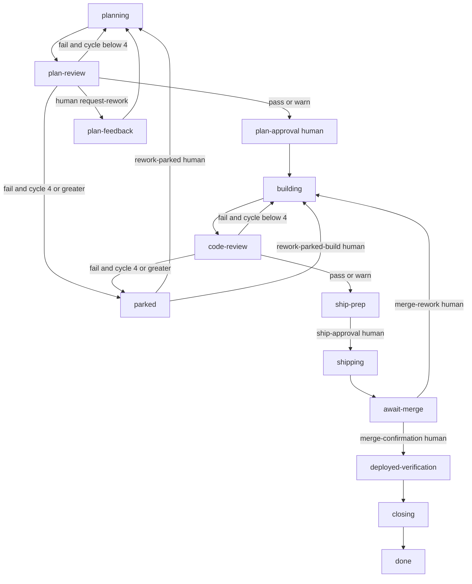

# Nightshift Autonomy Plan

Nightshift will evolve into an autonomous and semi-autonomous software delivery
system without replacing `the-nightshift` factory. `the-nightshift` stays the
only state machine. There is no polling workflow and no second factory. The
factory remains authoritative, existing workflows remain the execution units,
and a resident driver selects and propels work according to an explicit policy.

## Decisions

- Autonomous mode never grants `plan-approval`, `ship-approval`,
  `merge-confirmation`, `rework-parked`, `abort-confirmation`, or
  `cycle-override`.
- When no work is actionable, autonomous mode reports the human queue and
  idles until work changes or it is told to stop.
- A failed plan-review or code-review round parks automatically at cycle 4.
- Parked work requires explicit human approval to return to planning or
  building.
- `the-nightshift` remains the only delivery state machine.
- GitHub Project status remains independent coarse board state. Swamp does not
  recreate factory stages as board columns.
- Factory reports measure lifecycle flow. `@mgreten/cli-agent` invocation
  records measure LLM tokens and provider-reported cost. Reports join the two
  sources rather than adding cost fields to factory state.

## Why

The current factory already matches the Mandible delivery loop:

1. Plan.
2. Seven-lane plan review.
3. Build.
4. Seven-lane code review.
5. Ship and exact-commit verification.
6. Merge confirmation, deployed verification, and cleanup.
7. Rework arcs for candidate failures.

The missing pieces are a resident driver, first-class parking, automatic queue
selection, and fleet analytics.

Current run data also shows the review-loop behavior described in
"6 Learnings from 12,000 Agentic Code Reviews." Work item `106` accumulated 18
code-review artifact versions, failed through cycle 6 with findings moving
between clean-code, test-coverage, frontend, and observability, then ended at
`round:warn`. Latest code reviews are almost all `round:warn`. More rounds were
not consistently converging. Watson's data found that 65% of work was already
mergeable after one round and that review loops oscillated after round 4. The
Nightshift gap is the resident driver, a review-elbow park, and honest review
analytics.

Nightshift's existing CLI-agent data is sufficient for execution-agent usage
reporting:

- 696 existing Nightshift invocations are tagged with `factory: nightshift`.
- All 696 include token counts and a workflow run ID.
- All 696 include `costUsd`, but only 206 currently report a nonzero value.
- The invoked models span OpenAI, MiniMax, and xAI through the OpenCode
  provider.

A zero `costUsd` is not proof that an invocation was free. It may represent
subscription billing, an unpriced model, or unavailable provider pricing.
Reports must present it as provider-reported cost and expose zero/nonzero
coverage.

## Target Graph



Park only on a failed round at cycle 4 or later. A warning is already mergeable
because `findings-clear` blocks high findings, not medium warnings.

## Operating Modes

Existing modes remain supported. `rework-parked` and `autonomous` extend the
same machine.

| Mode                 | Mechanism                                       | Stop condition                    |
| -------------------- | ----------------------------------------------- | --------------------------------- |
| Single-feature drive | Current factory loop for one work item          | Human gate                        |
| Planning queue       | Serial `nightshift-plan-fanout`                 | Plan approval                     |
| Review swarm         | Existing `nightshift-review`                    | Findings recorded                 |
| Build fan-out        | Existing `nightshift-build-fanout`, maximum two | Code review                       |
| Plan-only            | Drive through plan review only                  | Plan approval                     |
| Closeout             | Ship, deployed verification, and close          | Merge confirmation                |
| Recovery             | Resume with `status`, never `start`             | Ambiguous failure classification  |
| Rework-parked        | Human-approved transition from `parked`         | Approval decision                 |
| Autonomous           | Scheduler over all modes                        | Explicit stop or idle human queue |

Autonomous and recovery selection order:

1. Retry configuration or infrastructure failures.
2. Run pending plan or code reviews.
3. Build ready independent work, at most two items.
4. Plan queued items serially.
5. Perform interactive ship preparation.
6. Skip human-wait and parked items while other work remains.
7. Report the human queue and idle when nothing is actionable.

Checkout constraints remain unchanged. Metadata-only intake may overlap.
Planning, building, reviewing, shipping, and verification remain mutually
exclusive within one checkout.

## Phase 0: Driver as Data, Not Folklore

Do not add models in this phase.

- Add `.agents/skills/software-factory/references/nightshift-modes.md` and
  reference it from the software-factory skill.
- Record the mode table, selection order, checkout exclusions, and idle
  behavior as the resident driver's contract.
- Reject malformed work-item identities such as `#106`; canonical Nightshift
  work items are decimal GitHub issue numbers.
- Run factory `summary` for existing terminal items to persist before-change
  `@mgreten/software-factory-flow-metrics` reports.
- Capture a baseline Nightshift factory-analytics report before changing the
  review limit.

Do not add auto-approval, Datadog/Sentry, a second factory, a polling
`swamp serve`, or a `nightshift-autonomous` workflow in this phase.

## Phase 1: Elbow as Factory Data

Edit `models/@swamp/software-factory/the-nightshift.yaml`.

- Add a non-terminal `parked` stage with no work block.
- Set `plan-review` and `code-review` `maxCycles` to 4.
- Keep each existing `rework` transition, but require a failed round and a
  review cycle below 4.
- Add `park` transitions from plan-review and code-review. Require a fresh
  failed review and a cycle of 4 or greater. Do not require human approval, so
  unambiguous propulsion parks automatically.
- Add `rework-plan` from `parked` to `planning`, gated by human approval
  `rework-parked`.
- Add `rework-build` from `parked` to `building`, gated by human approval
  `rework-parked-build` and the existence of a change summary.
- Keep the global human-approved abort transition available.
- Do not use a cycle override as a parked exit.
- Update the `SWAMP.md` Current Limits section to describe the parked stage and
  rework procedure.

Verify with:

```sh
swamp model method run the-nightshift validate
swamp model method run the-nightshift describe
```

Review the rendered machine before starting new work.

## Phase 2: Queues That the Docs Already Claim

- Create `nightshift-plan-fanout` as a Swamp workflow. It accepts unique work
  items, iterates through `nightshift-plan`, and uses concurrency 1 because the
  planner model has one shared lock.
- Keep `nightshift-build-fanout` at concurrency 2.
- Do not add a review fan-out workflow until a real workload requires batching
  multiple work items already in plan-review or code-review. Each individual
  review already fans out seven lanes.
- Keep issue creation and intake in `nightshift-create-intake` and
  `nightshift-intake`.
- Autonomous mode may intake prepared features or open GitHub issues that do
  not have a matching `the-nightshift` state record.
- Extend `scripts/workflow-contract.test.mjs` for every new
  `workflow-nightshift-*` execution and exclusivity rule.

Verify with:

```sh
swamp workflow validate nightshift-plan-fanout
node --test scripts/workflow-contract.test.mjs
```

Work-item dependencies, epic gates, remote multi-host execution, and
overlapping plan/build work in one checkout remain out of scope.

## Phase 3: Autonomous Resident Driver

Autonomy is a driver policy over existing factory work specifications, not a
second delivery DAG.

The loop is:

1. Refresh fleet `status`.
2. Classify each run as actionable, human-wait, parked, terminal, or malformed.
3. Select work using the documented priority and concurrency policy.
4. Call `record_dispatch` before every work-bearing stage.
5. Execute the resolved workflow, method, dispatch, or interactive work spec.
6. Record all artifacts and evidence through the factory.
7. Automatically take one unambiguous transition with no human gate.
8. Leave human-gated and parked items in place and select other work.
9. When no actionable work remains, fetch gate subjects from Swamp data,
   report the human queue, and idle.
10. Stop promptly when instructed.

The driver never calls `approve` or `reset` without explicit human
instruction. Ship preparation remains interactive. The driver may open the
candidate pull request according to `agent-constraints/ship-prep.md`, but it
stops that item at `ship-approval`.

### Driver Usage Coverage

Planner, reviewer, and builder agents already run through
`@mgreten/cli-agent`, so their usage is captured. An interactive OpenCode
resident driver is outside those invocation records. Its orchestration tokens
and cost must be reported as unavailable, not zero.

If complete driver metering becomes necessary, launch the resident driver
through an existing CLI-agent model with tags `factory`, `stage: driver`,
`mode`, and `workItem` where applicable. Do this only if a bounded CLI-agent
session can still idle and stop safely; do not compromise control behavior only
to obtain metering.

## Phase 4: Review and LLM Analytics

Keep `@mgreten/software-factory-flow-metrics` on factory `summary`. Add
`extensions/reports/nightshift_review_analytics.ts`, exporting one
Nightshift-specific deterministic report named
`@funsaized/nightshift-factory-analytics`.
Require it on factory-wide `status` and per-item `summary`. Lane and `ROUND`
history remains outside the generic flow report and belongs in this report.

The report joins two existing data planes:

| Source                                                                    | Authority                                                                                |
| ------------------------------------------------------------------------- | ---------------------------------------------------------------------------------------- |
| `the-nightshift` state, journal, artifact, evidence, and approval records | Stage history, review rounds, gates, parks, outcomes, and elapsed time                   |
| `@mgreten/cli-agent` `invocation` records                                 | Provider, model, tokens, `costUsd`, duration, retries, success, and workflow attribution |

Use CLI-agent records where `attributes.tags.factory == "nightshift"`.
Attribute them using `attributes.tags.workItem` and catalog
`workflowRunId`. Use `stage`, `phase`, and `lane` tags for breakdowns. Do not
parse invocation names as the primary join. Existing Nightshift records have
the required tags and workflow IDs.

Do not use `collectLocalUsage` as factory usage. It aggregates native local
sessions by day and could include unrelated work or double-count CLI-agent
invocations. It may be used only as an operational reconciliation report.

### Review Effectiveness

Report:

- Mergeable and clean-pass probability by round using Kaplan-Meier estimates.
- `P(pass this round | not yet)` to distinguish convergence from oscillation.
- First mergeable round, including censored parked, aborted, and in-flight
  work.
- Plan-review rounds versus code-review rounds, compared with Mandible's 19/81
  split.
- Per-lane pass, warn, and fail counts, including whether clean-code continues
  to dominate failures as it did for work item `106`.
- Findings that appear in a lane after that lane was previously clean.
- Unassessed lanes and configuration/infrastructure failures.
- Median review rounds by calendar period and against delivered volume.
- Review cycle at which marginal mergeability improvement stops.

### Token Usage

For every invocation and aggregate, report available values separately:

- Input tokens.
- Output tokens.
- Cache-read tokens.
- Cache-write tokens.
- Reasoning tokens.
- Total tokens.
- Invocation count, duration, retry count, and success rate.

Do not add cache-read or cache-write counts to `tokens.total`; the CLI-agent
record already supplies the provider-normalized total. Label cross-provider
comparisons because providers may account for cache and reasoning tokens
differently.

Break token usage down by:

- Work item.
- Factory stage.
- Plan versus code review.
- Review round.
- Review lane.
- Planner, builder, reviewer, and metered driver role.
- Provider and model.
- Terminal outcome: done, aborted, parked, or in flight.
- Mergeable, clean-pass, and never-clean-pass cohorts.

### LLM Cost

Report only `invocation.attributes.costUsd` as `providerReportedCostUsd`.
Include:

- Total provider-reported cost.
- Median and percentile cost per work item.
- Cost by stage, round, lane, provider, and model.
- Cost to first mergeable plan and code review.
- Cost spent after the first mergeable round.
- Cost spent after review round 4.
- Cost of failed, retried, parked, and aborted work.
- Cost per delivered work item and per mergeable work item.
- Cost and tokens for clean-pass-only cohorts versus all started work, including
  censored observations.

Every cost table must also show:

- Invocation count.
- Token-covered invocation count.
- Nonzero-cost invocation count.
- Zero-cost invocation count.
- Unmetered driver or interactive work count when identifiable.

Never estimate missing USD from a hardcoded model price table in the first
version. Never interpret a zero as free. If normalized estimated cost is later
needed, add a separately versioned pricing source and display estimated cost
beside, never instead of, provider-reported cost.

### Efficiency Indicators

Combine the factory and CLI-agent records to calculate:

- Tokens and provider-reported cost per delivered item.
- Tokens and cost to first mergeable review.
- Rework token and cost multiplier over the first plan/build/review path.
- Review tokens and cost by round, showing the round-4 elbow.
- Tokens and cost spent on findings from lanes that were previously clean.
- Infrastructure/configuration failure token and cost waste.
- Median tokens and cost as delivery volume changes.
- Cache-read ratio by provider/model, with provider semantics disclosed.

These measurements answer whether additional review rounds improve quality or
only consume more model work.

### Report Verification

The report is static and deterministic; it must not invoke an LLM.

Verify it after factory-wide `status` and item `summary`:

```sh
swamp model method run the-nightshift status
swamp report get @funsaized/nightshift-factory-analytics --model the-nightshift --json
swamp model method run the-nightshift summary --input workItem=<issue-number>
swamp report get @funsaized/nightshift-factory-analytics --model the-nightshift --json
```

The report must mark unavailable values explicitly and retain source pointers
back to factory journal/artifact records and CLI-agent invocation records.

Charts, external time-series backends, and publishing this report as a public
extension remain out of scope until the local report proves useful.

## Phase 5: Evidence-Based Retuning

Run the tightened factory long enough to establish a useful sample, then tune
review briefs from the report.

- Start with lanes that dominate failures or tokens. The current baseline points
  first to test-coverage failures and frontend token use, with clean-code the
  next failure source.
- Tighten out-of-lane exclusions and concrete fail vocabulary before removing
  a reviewer.
- Treat parked-at-4 as the spend cap; move the mergeability elbow left by
  improving prompts, plans, builder feedback, and reviewer stability.
- If mergeable-at-round-1 is weak, compare builder quality, lane stability,
  tokens, and cost before increasing cycles.
- Prefer earlier mergeability and lower rework cost over chasing clean pass.

Baseline decision on 2026-09-01: retain all seven lanes and the round-4 park
cap. The report covers 13 canonical work items and 68 review rounds;
test-coverage produced 24 fails, clean-code 10, and frontend consumed 33.7M
tokens. There is not yet a stable mergeability elbow: gains occurred through
round 6 and work item 109's code phase remains unobserved. Work attributed
after round 4 consumed 43.5M tokens and $17.68 in provider-reported cost. Keep
round 4 as the existing spend cap, not as an inferred quality elbow. Do not
remove a reviewer, increase cycles, or make another brief change from this
mixed pre/post-tightening baseline. Revisit after a complete post-tightening
reporting period can be compared with this baseline.

## Verification Schedule

- During development, run only the narrow checks for the changed factory,
  workflow, skill, or report.
- Run `node --test scripts/workflow-contract.test.mjs` after Nightshift
  workflow or control changes.
- Run factory `validate` and `describe` after every graph change.
- Use local verification only when the change reaches source behavior covered
  by that workflow.
- Managed verification remains maintainer-dispatched for a pull request and is
  not part of the autonomous local driver.

## Out of Scope

- A second delivery state machine.
- Automatic human approvals or automatic merge.
- GitHub board columns for every factory stage.
- Polling behavior inside `swamp serve`.
- Build concurrency above two.
- Remote multi-host execution.
- Hardcoded LLM price estimation.
- Treating unmetered interactive driver usage as zero.
- Trust-boundary or managed-verification changes; this plan does not alter
  either.
