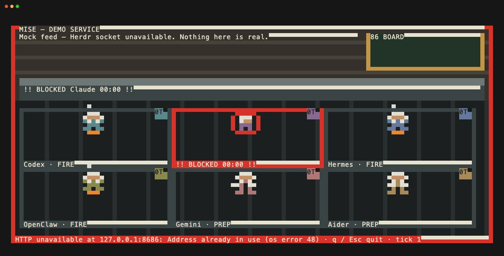
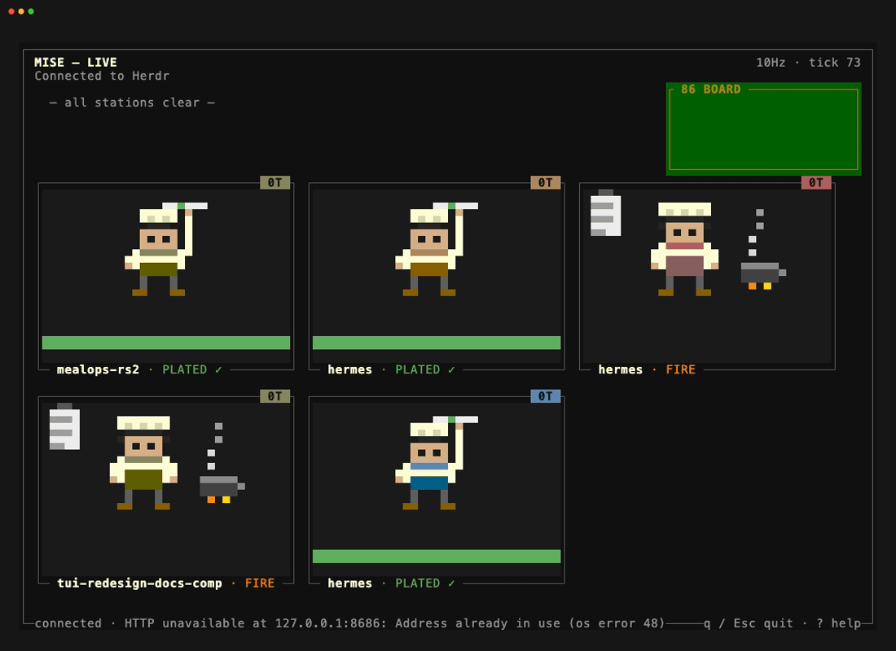
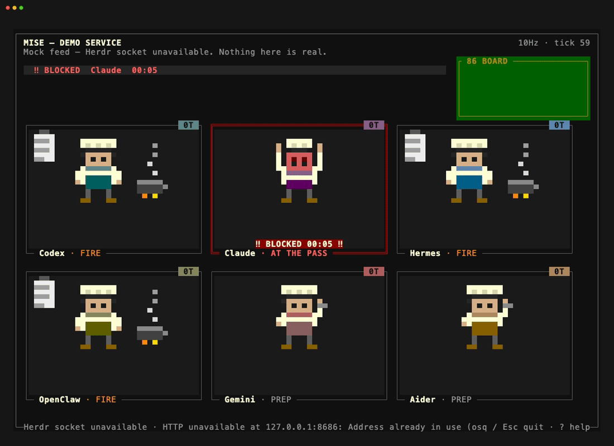
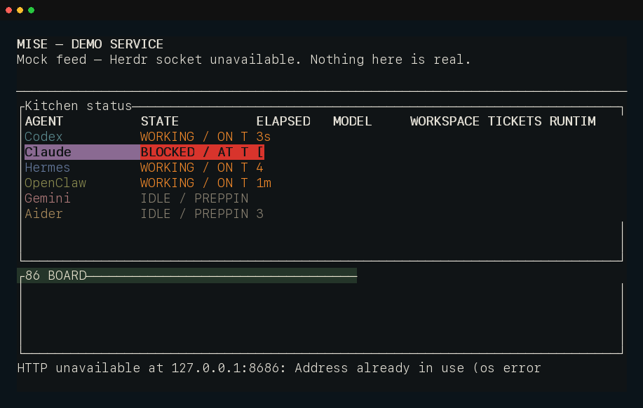

# herdr-mise

A localhost visualizer that renders AI coding agents as pixel-art line cooks in
a single restaurant kitchen. Agent state, the
ticket rail, the pass, the 86 board, and the kitchen lights are a glanceable
skin over a small, versioned JSON feed.

> IT's RAW!

_Gordon Ramsey_

herdr-mise does not control agents, render their output, or aggregate remote
servers. It is a window, not an office.


[Visual playground](docs/operations.md#visual-playground).

| Mixed lunch service                                                                                                            | Mixed dinner service                                                                                                                      | Settings                                                                                  |
| ------------------------------------------------------------------------------------------------------------------------------ | ----------------------------------------------------------------------------------------------------------------------------------------- | ----------------------------------------------------------------------------------------- |
|  |  |  |

The binary also runs as a TUI for terminal work. These terminal chefs are lower level, so they're relegated to primitive kitchen tools:



Mise remains a localhost-only, read-only projection. The browser playground,
terminal recording, and static fallbacks remain explicitly labeled
`DEMO SERVICE`; they do not claim live state.

| Live kitchen                                                                                           | Blocked at the pass                                                                                                                                         | Compact fallback                                                                                                                     |
| ------------------------------------------------------------------------------------------------------ | ----------------------------------------------------------------------------------------------------------------------------------------------------------- | ------------------------------------------------------------------------------------------------------------------------------------ |
|  |  |  |

Re-record the terminal demo with `npm run capture:tui`; see
[capture sources](docs/tui-scene-parity.md#cross-references).

## Quick start

Install Herdr, install this community plugin, and open its pane:

```sh
brew install herdr
herdr plugin install funsaized/herdr-mise
herdr plugin action invoke open --plugin mise.kitchen
```

The plugin installer downloads the pinned, verified release binary; users do
not need Node, npm, Cargo, or Rust. Herdr may require Git to clone community
plugins. See [Operations](docs/operations.md#installation) for logs, updates,
uninstall, standalone installation, and manual archive verification.

### Standalone

```sh
curl -fsSL https://raw.githubusercontent.com/funsaized/herdr-mise/main/install.sh | sh
herdr-mise --tui
```

Prefer the plugin installation when Herdr should manage pane registration.

### Homebrew and Linuxbrew

```sh
brew install funsaized/tap/herdr-mise
herdr-mise --tui
```

The formula installs Homebrew Core's `herdr` dependency but does not register a
Herdr plugin. Prefer `herdr plugin install funsaized/herdr-mise` for
Herdr-managed pane registration.

### live vs. demo

- **Live:** the `DEMO SERVICE` placard is absent and the WebSocket payload
  carries `mode: "live"`.
- **Demo:** a persistent `DEMO SERVICE` placard identifies deterministic mock
  data and names the source condition. Demo is not a successful live
  connection.

Troubleshooting: [Herdr socket unavailable](docs/operations.md#herdr-socket-unavailable),
[Herdr protocol not supported](docs/operations.md#herdr-protocol-not-supported).

### Herdr compatibility

The adapter accepts the protocols in the verified matrix below. Other product
versions on those protocols may work but are not part of the release matrix.

<!-- herdr-compatibility:start -->

| Herdr release | Snapshot protocol |
| ------------- | ----------------- |
| `0.7.5`       | `17`              |
| `0.8.0`       | `19`              |
| `0.8.2`       | `20`              |

<!-- herdr-compatibility:end -->

The authority is `compatibility/herdr.json`; each row names its immutable
upstream commit and sanitized fixture. Run `npm run check:herdr-compatibility`
to check runtime, docs, fixtures, and fixture privacy.

### Relationship

herdr-mise is an **independent community project**, not an official Herdr
project, and is not affiliated with, endorsed by, or maintained by the Herdr
team.

## What it is

- A single static binary serving a TypeScript browser client on
  `http://127.0.0.1:8686` and, with `--tui`, a native terminal kitchen.
- A read-only projection of local Herdr state. It does not approve, prompt,
  kill, or inspect agent output.
- A single-machine tool, not a remote dashboard, notification inbox, session
  log, or multi-host aggregator.

Blocked work must remain unmistakable from peripheral vision, and payload,
wire traffic, hidden-tab activity, and server resources remain bounded during
all-day use. The detailed browser/TUI representation audit is in
[Browser and TUI scene parity](docs/tui-scene-parity.md).

## Runtime modes

- **Demo:** deterministic cooks remain visibly labeled while the server retries
  a missing, timed-out, unsupported, or incompatible Herdr source.
- **Live:** a compatible snapshot atomically replaces the demo roster without a
  process or browser restart.
- **Disconnected:** browser silence surfaces `GAS LEAK — SERVICE SUSPENDED`,
  then reconnects through a fresh snapshot.
- **Empty:** a live source with no agents shows `Waiting for agents — start one
in herdr.`

## Local development

Use the deterministic client-only playground for visual work:

```sh
npm ci
npm ci --prefix client
npm run dev:visual
# open http://localhost:8686
```

Build the embedded client and release binary for integration work:

```sh
npm ci
npm ci --prefix client
npm run bundle
HERDR_SOCKET_PATH=/tmp/no-herdr.sock ./target/release/herdr-mise
```

See [Client development](docs/operations.md#client-development) for playground
presets, isolation guarantees, and plain Vite limitations.

## Contributor plugin development

Build from source for integration work:

```sh
npm ci
npm ci --prefix client
npm run bundle
./target/release/herdr-mise --tui
```

To exercise the published-binary plugin manifest from a checkout, link it:

```sh
herdr plugin link .
```

Open the linked pane with:

```sh
herdr plugin action invoke open --plugin mise.kitchen
```

The browser service continues alongside the TUI when its loopback port is free
(`8686` by default, or `HERDR_MISE_PORT`).

## Security and limitations

- The server binds only to `127.0.0.1`, on `8686` by default;
  `HERDR_MISE_PORT` changes only that loopback port. Browser WebSocket origins
  must match the effective port or be explicitly added for a personal reverse
  proxy, which owns its transport and access control.
- The binary sends no telemetry and performs no outbound product network
  requests. Live mode reads only the local Herdr Unix socket.
- Release archives and the installer support macOS arm64, macOS x86_64, and
  Linux x86_64 glibc. There is no background service or auto-update.
- Browser settings are local site data. Reduced motion is honored; the manual
  VoiceOver listening pass remains post-release work.

See [Security policy](SECURITY.md) and
[Operations](docs/operations.md) for the complete runtime and troubleshooting
contracts.

## Documentation

- [GitHub issues](https://github.com/funsaized/herdr-mise/issues) — accepted
  work, ownership, and current status.
- [Architecture](docs/architecture.md) — components, data flow, and trust
  boundaries.
- [Operations](docs/operations.md) — run, develop, diagnose, and troubleshoot.
- [Release operations](docs/releasing.md) — signing, publication, and recovery.
- [Contributing](CONTRIBUTING.md) — setup, verification, and review rules.
- [Security policy](SECURITY.md) — supported versions and private reporting.
