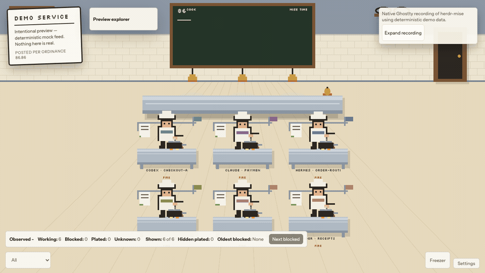
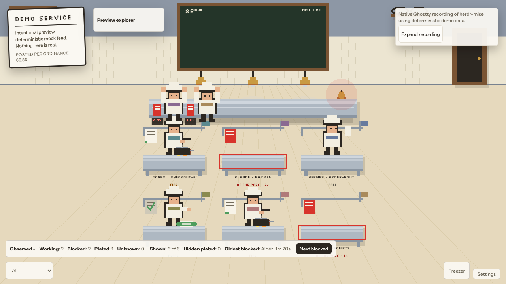
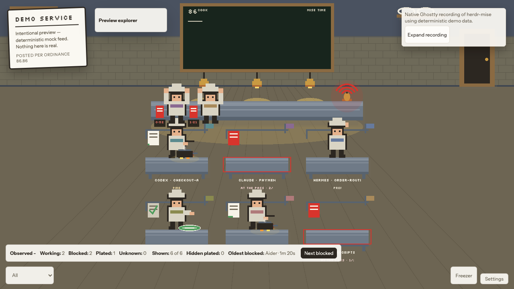
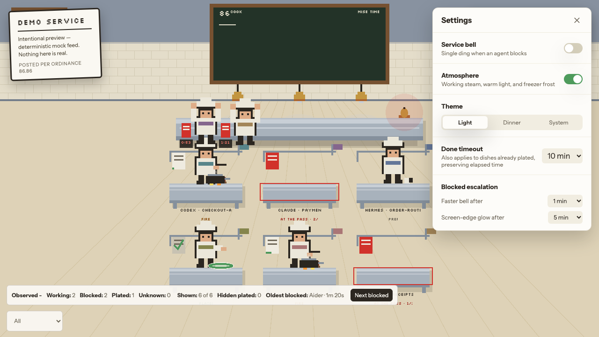

# herdr-mise

A localhost visualizer that renders AI coding agents as pixel-art line cooks in
a single restaurant kitchen. Each cook maps to one agent. Their state, the
ticket rail, the pass, the 86 board, and the kitchen lights are a glanceable
skin over a small, versioned JSON feed.

herdr-mise does not control agents, does not render their output, and does
not aggregate remote servers. It is a window, not an office.

## Quick start

Install Herdr, then download, verify, and run herdr-mise
`v0.1.0-rc.1`. Reach a truthful live kitchen in under five minutes.
Detailed platform commands live in
[Operations — local run](docs/operations.md#local-run).

### Install and start Herdr

Pick any official install path from <https://herdr.dev> (see the
[Herdr install docs](https://herdr.dev/docs/install)) and run
`herdr` in its own terminal — leave it running. Source or release
at <https://github.com/herdrdev/herdr>; latest stable is
[Herdr `v0.8.0`](https://github.com/herdrdev/herdr/releases).

```sh
curl -fsSL https://herdr.dev/install.sh | sh   # or: brew install herdr / mise use -g herdr
herdr   # keep this terminal running
```

### Download, verify, and run herdr-mise

In a **second** terminal: download the archive and its `.sha256`
sidecar, **verify the checksum first**, then extract and run. Full
per-platform detail and codesign checks:
[Operations — run the release archive](docs/operations.md#run-the-release-archive).

```sh
TAG=v0.1.0-rc.1
TARGET=aarch64-apple-darwin   # or x86_64-apple-darwin / x86_64-unknown-linux-gnu
BASE=herdr-mise-${TAG}-${TARGET}
URL=https://github.com/funsaized/herdr-mise/releases/download/${TAG}

curl -fsSL -O "$URL/$BASE.tar.gz" -O "$URL/$BASE.tar.gz.sha256" \
  && {
    if command -v shasum >/dev/null 2>&1; then
      shasum -a 256 -c "$BASE.tar.gz.sha256"
    else
      sha256sum -c "$BASE.tar.gz.sha256"
    fi
  } \
  && tar -xzf "$BASE.tar.gz" \
  && ./herdr-mise
```

Open <http://127.0.0.1:8686>.

### Recognize live vs. demo

- **Live.** The `DEMO SERVICE` placard is **absent** and the
  WebSocket payload carries `mode: "live"`.
- **Demo.** A persistent `DEMO SERVICE` placard is shown for
  `unavailableSocket`, `timeout`, `unsupportedProtocol`, or
  `incompatibleResponse`. Demo is **not** a successful live
  connection — its cooks are a deterministic mock.

Troubleshooting: [Herdr socket unavailable](docs/operations.md#herdr-socket-unavailable),
[Herdr protocol not supported](docs/operations.md#herdr-protocol-not-supported).

### Tested Herdr compatibility

The adapter (`server/src/adapter.rs`) accepts the protocols in the verified
matrix below; only snapshots outside that manifest-derived set trigger
`unsupportedProtocol`. Other product versions on those protocols are accepted
but are not part of the verified release matrix.

<!-- herdr-compatibility:start -->
| Herdr release | Snapshot protocol |
|---|---|
| `0.7.5` | `17` |
| `0.8.0` | `19` |
<!-- herdr-compatibility:end -->

The authoritative evidence is `compatibility/herdr.json`; each row names its
immutable upstream commit and manually sanitized fixture. Run
`npm run check:herdr-compatibility` to check runtime, docs, fixtures, and
fixture privacy without network access or credentials.

### Relationship

herdr-mise is an **independent community project**, not an official
Herdr project, and is not affiliated with, endorsed by, or
maintained by the Herdr team.



The GIF and screens below are repeatable captures from the isolated visual
playground's deterministic feed. Regenerate them with `npm run capture:readme`
(Playwright Chromium and `ffmpeg` required).

| Mixed lunch service | Mixed dinner service | Settings |
|---|---|---|
|  |  |  |

## What it is and what it intentionally doesn't show

- **Is:** a single static binary, `herdr-mise`, that serves a Vite-built
  TypeScript SPA on `http://127.0.0.1:8686` and fans out a versioned
  `AgentStateEvent` feed over one WebSocket endpoint
  (`server/src/main.rs`, `server/src/service.rs`).
- **Is:** read-only. It deliberately does not approve, prompt, or kill
  sessions. It tells you where to look, not what the agent is doing.
- **Is not:** an agent controller, a session log, a remote dashboard,
  a notification inbox, or a multi-host aggregator.

The product has two non-negotiables:

1. The blocked state is unmistakable from peripheral vision at 2+ meters.
2. Its payload, hidden-tab activity, server resources, and wire
   traffic remain bounded during all-day use.

## Native PixiJS kitchen scene

The scene is a single WebGL canvas owned by PixiJS
(`client/src/scene/kitchen-scene.ts`). React is only used for chrome
around the canvas: tooltip, detail card, session summary, settings,
mode treatments, semantic station controls, and the live region. React never
sits in the per-frame path; `scripts/audit-pixi-architecture.mjs` enforces this
in CI.

Cooks move through five states. The tokens module owns their visual
signatures; service red `#d8342c` is reserved for `blocked` and nothing else
(`client/src/theme/tokens.ts`, `scripts/audit-tokens.mjs`).

| State      | Kitchen metaphor      | Where the cook is                | Visual signature                         |
|------------|-----------------------|----------------------------------|------------------------------------------|
| `idle`     | Prepping              | Home station                     | Slow chop/wipe loop, no ticket            |
| `working`  | On the fire           | Home station                     | Flame + steam, white ticket, green edge  |
| `blocked`  | At the pass           | Pass front, red ticket at pass   | Red ring arcs, elapsed timer chip        |
| `done`     | Plated                | Home station                     | Plate under lamps, ticket spiked (gray)  |
| `ended`    | 86'd                  | Exits through back door          | Chalk row appended to the 86 board        |

State machine and rendering limits are enforced in code:

- Per-agent transitions are tweened with a hard 800 ms cap
  (`client/src/scene/transition.ts`).
- Rapid state changes converge to truth within 1 s
  (`client/src/state/store.ts` `reconcileRendered`).
- Pooled particles, single ticker, nearest-neighbor scaling
  (`client/src/scene/particles.ts`, `client/src/scene/kitchen-scene.ts`).

## Demo, live, and disconnected modes

The product is a single binary with three observable app modes that the
chrome surfaces honestly:

- **Demo service.** Until a compatible Herdr snapshot is available, the
  server runs a deterministic mock
  roster (`server/src/demo.rs`) and a persistent
  *DEMO SERVICE* placard is rendered in the chrome
  (`client/src/chrome/Chrome.tsx` `ModeTreatment`). The placard is not
  dismissible and names the actual non-sensitive condition: unavailable
  socket, timeout, unsupported protocol, or incompatible response. The server
  retries with exponential backoff from 250 ms to a 4 s ceiling.
- **Live service.** When `server/src/feed.rs` accepts a supported Herdr
  snapshot, the same process atomically replaces the demo roster, flips to
  `live`, and removes the placard; no restart or browser reload is needed.
- **Disconnected.** A typed 1 Hz `heartbeat` keeps the liveness timer
  from firing on a quiet live feed
  (`server/src/service.rs`, `protocol/fixtures/heartbeat.v1.json`).
  When the WebSocket stays silent for ~2.9 s the client surfaces
  *GAS LEAK — SERVICE SUSPENDED* and a `Retrying — last update Ns ago`
  counter, reconnects in 1 s, and resyncs from a fresh snapshot
  (`client/src/state/ws-client.ts`, `client/src/chrome/Chrome.tsx`).
- **Empty kitchen.** Connected with zero agents, the chrome shows a
  lower-center pill *Waiting for agents — start one in herdr* and the
  back door sits ajar.

## Prerequisites

- macOS arm64, macOS x86_64, or Linux x86_64 for release binaries.
- Rust stable toolchain, `rustfmt`, the `aarch64-apple-darwin` target
  on Apple Silicon.
- Node.js 22, npm.
- The Herdr ecosystem at protocol version 17 or 19. The adapter is the
  only module with herdr-schema knowledge; it accepts any product patch
  version when the socket reports a supported protocol (see
  `server/src/adapter.rs`).

No system-level install, no Homebrew formula, no launchd unit. The
binary binds to `127.0.0.1:8686` only and is not registered to start
on login.

## Local development

Two paths. The visual playground is the one-command client-only dev
loop — no Rust server, no socket discovery, deterministic feeds.
The full build is for integration, live, and demo testing against
the Rust binary.

### Visual playground (no Rust required)

```sh
# from the repo root
npm ci
npm ci --prefix client
npm run dev:visual
# open http://localhost:8686
```

`npm run dev:visual` launches Vite with hot module reload in the
`visual` mode. That mode installs a deterministic in-browser
WebSocket mock before React mounts, and the real client
`AgentWebSocketClient` still opens `/ws` against the live origin —
the mock is installed in the browser, not hosted by a server. Use query
parameters to compose the scene:

- `preset=idle|working|blocked|done|ended|mixed` (default `mixed`)
- `agents=1..12` (any integer from 1 through 12; default `6`)
- `theme=light|dinner` (default `light`; `dinner` selects the
  existing dark lighting)

Examples:

```text
?preset=done&agents=2                          # two plated cooks
?preset=blocked&agents=12&theme=dinner         # full kitchen at the pass, dim lighting
?preset=ended&agents=6                         # cooks replaced by 86 board entries
?preset=mixed&agents=6                         # heterogeneous brigade sharing several states
```

The `mixed` preset is the README presentation feed: six inspectable agent,
model, and workspace identities share idle, working, blocked, and done states.
On each fresh connection, Codex works for five seconds, waits at the pass for
two seconds, resumes with a brief `ANSWER RECEIVED` cue, and plates the work by
9.5 seconds (`client/src/visual-harness.ts`); the other five cooks keep the
brigade visibly active throughout the sequence.
It remains isolated to visual mode and does not alter production or live feeds.

`ended` first emits a `done` snapshot, then one `ended` upsert per
record — so no active cooks remain and every record's truthful final
state is `done` on the 86 board. The `done` preset uses the same
10-minute timeout shown in Settings; visual mode does not hide a
different timeout behind the UI.
Preset records start at realistic deterministic ages: 12 seconds
for `idle`, 18 seconds for `working`, 45 seconds for `blocked`, and
8 seconds for `done` (including the snapshot used by `ended`). The
blocked age remains below the default 60-second first escalation
threshold.

Visual mode neither needs nor contacts Rust or herdr. The install
preserves the native `WebSocket` constructor and only handles the
`/ws` pathname, so Vite HMR and unrelated sockets keep working. It
does not read or write persisted production settings or the
`mise-bell-hint` localStorage key. The bell hint starts visible on
each visual-mode load, can be dismissed for that page session, and
returns on reload without changing production state.

The full query contract, defaults, and isolation rules are in
[Operations — client development: visual
playground](docs/operations.md#client-development).

### Full build (Rust + client)

```sh
# from the repo root
npm ci
npm ci --prefix client

# build the client, embed it into the Rust binary, and run
npm run bundle
HERDR_SOCKET_PATH=/tmp/no-herdr.sock ./target/release/herdr-mise
# open http://127.0.0.1:8686
```

To exercise the live path against a running herdr, drop the override
and run `./target/release/herdr-mise`; the server will auto-discover
the socket. `npm --prefix client run dev` against the full build
without a proxy does not give you a working `/ws` — see
[Operations — client development: plain Vite
limitations](docs/operations.md#client-development).

## Install a release binary

v0.1.0-rc.1 ships as three archives on the matching GitHub **prerelease**.
There is no installer, Homebrew formula, launchd unit, or auto-update. Each
archive contains the `herdr-mise` executable, the project `LICENSE`, and a
generated `THIRD_PARTY_NOTICES.txt` covering locked Rust and JavaScript
dependencies plus the bundled fonts.

| Platform | Target triple | Archive |
|---|---|---|
| macOS Apple Silicon | `aarch64-apple-darwin` | `herdr-mise-v0.1.0-rc.1-aarch64-apple-darwin.tar.gz` |
| macOS Intel | `x86_64-apple-darwin` | `herdr-mise-v0.1.0-rc.1-x86_64-apple-darwin.tar.gz` |
| Linux x86_64 | `x86_64-unknown-linux-gnu` | `herdr-mise-v0.1.0-rc.1-x86_64-unknown-linux-gnu.tar.gz` |

Always download the archive **and** its `.sha256` sidecar, verify the checksum
before extraction, and allow any failed step to prevent execution. The sole
detailed, copy-pasteable procedure—including portable checksum selection—is
[Operations — run the release archive](docs/operations.md#run-the-release-archive).

On macOS, the release binary is signed and notarized. It is a bare CLI rather
than an app bundle, so Apple's app-assessment tool is not an applicable
acceptance check; verification details are in
[Operations — standalone CLI notarization](docs/operations.md#standalone-cli-notarization-no-stapling).

### Upgrade

1. Stop the running process (`Ctrl-C`, or `kill` the PID listening on
   `127.0.0.1:8686`).
2. Download the new archive + `.sha256` for your target.
3. Verify the checksum, extract, and replace the old `herdr-mise` binary
   with the new one (same path or any path you prefer).
4. Start `./herdr-mise` again.

Settings live in the browser
(`localStorage["herdr-mise:settings"]`) and survive a binary swap until
you clear site data.

### Uninstall

Stop the process and delete the `herdr-mise` binary (and any leftover
archives/sidecars). Optionally clear `localStorage["herdr-mise:settings"]`
and the `mise-bell-hint` key in the browser origin you used. Nothing else
is installed on the host.

Operator signing, tag publication, and failure recovery live in
[Operations — publishing a signed prerelease](docs/operations.md#publishing-a-signed-prerelease).

If the chrome still shows the `DEMO SERVICE` placard after following
the steps above, see
[troubleshooting — Herdr socket unavailable](docs/operations.md#herdr-socket-unavailable)
and
[troubleshooting — Herdr protocol not supported](docs/operations.md#herdr-protocol-not-supported).

## URL and security model

- **Localhost only.** The HTTP listener binds to `127.0.0.1:8686` and
  nowhere else (`server/src/main.rs`).
- **No telemetry.** The binary does not phone home, collect analytics, or
  open outbound product network connections. Live mode only reads the local
  herdr Unix socket you already run; demo mode is fully local.
- **Runtime-embedded assets.** The client bundle and vendored fonts ship
  inside the binary via `rust-embed` (`server/src/service.rs`,
  `server/Cargo.toml`). There is no remote fetch of UI assets at runtime.
- The WebSocket endpoint at `/ws` accepts a missing `Origin` header
  for CLI/test clients, and only `http://localhost:8686` or
  `http://127.0.0.1:8686` from browsers. Anything else returns
  HTTP 403 (`server/src/service.rs` `allowed_origin`).
- `HERDR_MISE_EXTRA_ORIGINS` (opt-in) adds exact extra browser
  origins to the `/ws` allowlist for personal reverse-proxy setups
  (e.g. Caddy over Tailscale). The bind stays loopback-only; the
  proxy owns transport and access control. Invalid values abort
  startup. See [Operations — remote viewing through a personal
  reverse proxy](docs/operations.md#remote-viewing-through-a-personal-reverse-proxy).
- This is **not** a multi-host deployment and does not implement
  non-localhost hardening. Do not bind this binary to a public interface.

## Herdr discovery precedence and socket override

The server picks the herdr Unix socket path in this order
(`server/src/discovery.rs`, tested in `discovery_precedence`):

1. `HERDR_SOCKET_PATH` if set and non-empty.
2. `$XDG_CONFIG_HOME/herdr/herdr.sock` if `XDG_CONFIG_HOME` is set.
3. `$HOME/.config/herdr/herdr.sock` if `HOME` is set.
4. `./.config/herdr/herdr.sock` as a last resort.

If a probe fails, the server uses the demo feed while it keeps retrying.
Snapshots carry both `"mode": "demo"` and a typed `sourceStatus`; a newly
available compatible source is normalized before an atomic live snapshot
replaces the demo roster
(`server/src/feed.rs`, `server/src/demo.rs`).

## Settings, keyboard, accessibility

- Settings persist across reloads through
  `localStorage["herdr-mise:settings"]`, version 1, with field-safe
  defaults on corrupt or stale records
  (`client/src/state/settings-storage.ts`).
- Defaults: service bell **off**, theme **System**, done timeout
  **10 min**, faster bell **1 min**, screen-edge glow **5 min**
  (`client/src/state/store.ts` `defaultSettings`).
- Keyboard: `Esc` closes any panel or deselects; `s` toggles the
  stats overlay; arrow keys or `Tab` cycle station focus with a
  visible ring; `Enter` opens the focused station
  (`client/src/keyboard.ts`, `client/src/App.tsx`). Settings selects
  and toggles keep their arrow-key and typing behavior; the global
  handler skips interactive targets
  (`client/src/keyboard.ts` `isInteractiveKeyboardTarget`).
- Accessibility: every state is triple-encoded — position and motion
  (where the cook is), color, and a state word under every station
  plus plain words in tooltips. Service red and fresh green are
  shape-disambiguated by bell vs. plate. Each canvas station has a semantic
  button equivalent for assistive technology, while a polite live region
  announces state changes only. Chrome text and canvas station labels in both
  themes meet WCAG AA — see `scripts/audit-accessibility.mjs`.
- Sound: a single lazy `AudioContext` is shared across dings and
  resumes from the toggle-on gesture. The default is **off**; the
  bell dings once on entering blocked and again at each escalation
  threshold, never continuously
  (`client/src/sound/bell.ts`).

### Reduced motion and blocked-state salience

herdr-mise follows the live OS `prefers-reduced-motion` preference. A change
takes effect without a browser reload. With reduced motion enabled, the scene
stops decorative idle marks and pose animation, steam particles, cook bob and
flame flicker, travel/transitions, busser sweeps, and blocked pulse/vignette
pulse. Lifecycle reconciliation, blocked elapsed text, keyboard focus and
controls, state announcements, and state salience remain active.

Blocked is still explicit and static: the cook is fixed at the pass, with a
high-contrast outline, home/pass tickets, and an elapsed timer. The visible
state text is `AT THE PASS`; its semantic station control keeps an accessible
name such as `Codex, Blocked — at the pass, open details`. Bell arcs are solid,
and the escalation vignette uses fixed opacity when its blocked stage is active.
The signal uses text and shape as well as color or motion.

For the executable human acceptance record, use the [reduced-motion and
VoiceOver checklist](docs/operations.md#reduced-motion-and-voiceover-acceptance).
The checklist starts as `NOT RUN`; it is not evidence of a completed VoiceOver
session.

## Verification commands

These are the exact commands the project uses as gates. Each is
locally runnable today.

| Gate                      | Command                              | Notes |
|---------------------------|--------------------------------------|-------|
| Rust format               | `cargo fmt --all --check`            | |
| Rust check                | `cargo check --workspace`            | |
| Rust tests                | `cargo test --workspace --locked`    | typed heartbeat, snapshot-before-delta, protocol-17/19 adapter, ended eviction, coalescer, WS origin policy and extra-origin opt-in |
| Client typecheck          | `npm run typecheck`                  | |
| Client lint               | `npm run lint`                       | |
| Client tests              | `npm test`                           | store, WebSocket, visual harness, chrome, settings, protocol fixtures, layout and sound |
| Token audit               | `npm run audit:tokens`               | service red must be blocked-only |
| Architecture audit        | `npm run audit:architecture`         | native Pixi classes only |
| Accessibility audit       | `npm run audit:accessibility`        | Chrome and day/dinner station-label contrast ≥ 4.5:1 |
| Production build          | `npm run build`                      | |
| Bundle budget             | `npm run check:bundle`               | WebGL gzip ≤ 400 KB, total transfer ≤ 1.5 MB |
| Embedded-binary smoke     | `npm run smoke`                      | binds 127.0.0.1:8686, demo roster of 12, graceful shutdown |
| Server resource assertions| `npm run measure:server`             | RSS ≤ 50 MiB, CPU ≤ 1% |
| Release pipeline check    | `npm run validate:release`           | validates the locally available target; tagged builds validate all three release targets |
| Performance suite         | `npm run perf`                       | Browser startup, bundle, latency, hidden-tab, and wire-traffic gates; server resources are covered separately |

## Performance policy

These are release bounds, not optimization targets:

- Cold start to first rendered frame: ≤ 1.5 s on localhost.
- Total compressed client transfer ≤ 1.5 MB; WebGL-path JS
  ≤ 400 KB gzip.
- Event-to-pixel latency p95 ≤ 250 ms.
- Hidden render loop stopped, hidden CPU ≤ 0.1%, and visibility
  resume ≤ 100 ms. The harness uses a fixed 60 s hidden window.
- Server RSS ≤ 50 MB and CPU ≤ 1% at 12 chatty demo agents.
  `scripts/measure-server.sh` enforces both assertions.
- Steady-state WebSocket traffic ≤ 5 KB/s, with high-frequency
  signals coalesced to ≤4 Hz per agent.

## Known limitations

- **README media and perf evidence have different jobs.**
  `npm run capture:readme` owns the screenshots and animated GIF.
  `perf/client.perf.spec.ts-snapshots/demo-service-darwin.png` is the accepted
  performance-suite pixel baseline and is only re-baselined deliberately.
- **Host-timing measurements do not run on shared CI hardware.** `npm run perf`
  remains the controlled local acceptance command. CI runs deterministic tests,
  the cross-platform visual behavior matrix, bundle budgets, Rust resource checks,
  and release validation instead.
- **Release validation covers every published target.** macOS arm64, macOS
  x86_64, and Linux x86_64 archives pass
  `scripts/verify-release-artifact.sh` before publication.
- **Visual and hidden-tab baselines are acceptance gates, not promises.** Any
  meaningful drift requires investigation before re-baselining.
- **herdr-mise is single-machine and localhost-only.** It does not include
  non-localhost hardening. Do not bind the binary to a
  public interface; do not put it behind a reverse proxy without
  reviewing the loopback-only security model above.
- **Distribution is the GitHub prerelease only.** herdr-mise is not on
  crates.io, npm, Homebrew, or any launchd-distributed package. A
  matching `v*` tag publishes six public assets (three archives + three
  `.sha256` sidecars) on a GitHub **prerelease**; PR and manual workflow
  runs only build and validate.

## Where to read more

- [docs/architecture.md](docs/architecture.md) — durable ASCII
  architecture diagram and concrete request/event flow, including
  trust and security boundaries.
- [docs/operations.md](docs/operations.md) — local run, client
  development (visual playground and plain Vite limitations),
  socket override, demo fallback, source-loss and recovery
  semantics, package and checksum verification, diagnostics,
  troubleshooting.
- [docs/backlog.md](docs/backlog.md) — proposed initial-RC backlog with
  implementation scope, dependencies, acceptance criteria, and validation.
  Accepted work is tracked in GitHub issues.
- [SECURITY.md](SECURITY.md) — supported versions, threat model, and private
  vulnerability reporting.
- [CONTRIBUTING.md](CONTRIBUTING.md) — setup, verification gates, and review
  expectations for contributors.
