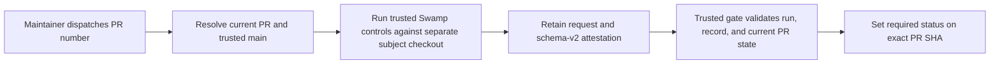

# Swamp systems for herdr-mise

This is the operational reference for managed verification and the Nightshift
software factory. For the shorter contributor and maintainer procedure, see
[`docs/local-verification.md`](docs/local-verification.md). The completed
migration record is in
[`docs/managed-verification-migration.md`](docs/managed-verification-migration.md).

## System boundary

Swamp owns the deterministic source checks. GitHub owns authorization, hosted
execution, exact-SHA coordination, artifact retention, and the required status.



The managed workflow conclusion is the execution signal. The Swamp attestation
is structured audit data, not independent proof that commands honestly ran.
Release artifacts are rebuilt by trusted release infrastructure; PR artifacts
are never promoted.

## Components

| Path                                                 | Purpose                                                             |
| ---------------------------------------------------- | ------------------------------------------------------------------- |
| `workflows/workflow-verification.yaml`               | Shared deterministic verification DAG                               |
| `verification/managed-policy.json`                   | Schema-v2 steps, configuration, producer, and trust-boundary policy |
| `extensions/models/verification_evidence.ts`         | Base evidence schema and shared safe file/hash helpers              |
| `extensions/models/verification_evidence_managed.ts` | Managed schema-v2 collector                                         |
| `scripts/managed-verification-evidence.mjs`          | Trusted gate validator                                              |
| `.github/workflows/swamp-managed-verification.yml`   | Maintainer-dispatched resolver and unprivileged executor            |
| `.github/workflows/swamp-managed-gate.yml`           | Trusted exact-SHA status gate                                       |
| `scripts/workflow-contract.test.mjs`                 | Workflow permission, trigger, pin, and trust-path contracts         |

The workflow uses these models:

| Model                     | Type                               | Purpose                                             |
| ------------------------- | ---------------------------------- | --------------------------------------------------- |
| `verification-source-git` | `@swamp/git`                       | Verify exact subject/base identity and ancestry     |
| `verification-root`       | `@funsaized/npm/project`           | Install and run root checks in the subject checkout |
| `verification-client`     | `@funsaized/npm/project`           | Install locked client dependencies                  |
| `verification-rust`       | `@funsaized/herdr-mise-rust`       | Run commit-bound Rust checks                        |
| `verification-evidence`   | `@funsaized/verification-evidence` | Collect the schema-v2 managed attestation           |

## Shared workflow

`verification` requires `commit`, `baseCommit`, and `subjectRoot`. It first
checks the exact clean subject and base ancestry, then performs locked npm
installs, browser setup, fallback-asset tests, formatting, build, Rust checks,
type checking, linting, unit and browser tests, compatibility and accessibility
audits, bundle checks, and release-layout validation. Collection runs only after
all controls succeed.

An advisory local run is:

```sh
swamp workflow validate verification --json
swamp workflow run verification \
  --input commit=$(git rev-parse HEAD) \
  --input baseCommit=$(git rev-parse upstream/main) \
  --input subjectRoot=. \
  --json
```

The local producer cannot satisfy the managed gate.

## Managed executor

`.github/workflows/swamp-managed-verification.yml` accepts only an open pull
request number and must be dispatched from `main` by a repository writer. Its
resolver has read-only Actions, contents, and pull-request permissions. It:

1. Resolves the current PR head, current canonical `main`, workflow identity,
   dispatcher, repository IDs, and exact diff.
2. Requires `main` to equal both the PR base and trusted workflow control SHA.
3. Allows only `@funsaized` to dispatch trust-boundary changes.
4. Retains immutable request metadata.

The separate executor has `permissions: {}`, no secrets, and no environment. It
fetches exact control, subject, and base commits without persisted credentials,
installs the pinned Swamp version from trusted control, restores pinned
extensions, and runs the shared workflow. Request and attestation artifacts are
retained for 30 days; sanitized failure diagnostics are retained for 7 days.

## Trusted gate

`.github/workflows/swamp-managed-gate.yml` runs only after the named managed
workflow. Before setting a status it validates:

- immutable workflow ID, path, event, branch, run, attempt, and dispatcher;
- exactly one request artifact and, after success, one attestation artifact;
- current open PR identity, head SHA, base SHA, and canonical `main` SHA;
- trusted control checkout and passive exact subject checkout;
- managed producer identity and owner authorization for trust changes;
- schema-v2 policy, workflow and configuration digests;
- required step order, outputs, timing, clean-tree and lockfile bindings;
- artifact manifests, freshness, and canonical evidence root.

The gate loads policy and validator code from trusted `main`, never from the PR.
It sets `Swamp managed verification` success only on the still-current head. It
sets failure when request identity is safe but execution or validation fails,
and avoids setting a status when identity cannot be established safely.

## Required checks

Branch protection for `main` requires:

```text
rust-advisories
review
scan
CodeQL
Swamp managed verification
```

Strict mode, administrator enforcement, linear history, conversation
resolution, force-push prevention, and branch-deletion prevention remain
enabled. Branch-protection settings are external runtime configuration and must
be audited separately from repository tests.

## Historical evidence

The protected `ops/evidence` branch contains immutable schema-v1 records from
the retired local publication system. No active workflow reads or writes it.
Push exclusions remain in CI and CodeQL so preserving the branch cannot create
verification loops. Keep it protected and readable; never force-update, delete,
or rewrite historical records.

## Nightshift Factory

Nightshift is a gated software-delivery state machine. It tracks independent
work items from planning through deployed verification and closure. The factory
stores state and enforces gates. An active human or agent driver selects and
propels work; `swamp serve` does not poll queued work.

### Capabilities

- State, evidence, artifacts, and journals are namespaced by work item.
- Planning persists a plan and runs seven isolated review lanes.
- Approved builds use per-work-item agent models and sibling Git worktrees.
- `nightshift-build-fanout` builds at most two ready work items concurrently.
- Code review runs seven isolated specialist lanes concurrently.
- Candidate failures return to implementation.
- Configuration and infrastructure failures retry their operational stage.
- Shipping verifies an exact commit.
- Deployed verification checks the exact merged pull-request revision.
- Cleanup removes generated artifacts and clean worktrees.
- Dirty source is preserved for inspection.
- Planning and adversarial review results are published to the GitHub issue.

### State Ownership

State has three deliberately independent owners:

| Concern                                                     | Owner                                    | Contract                                                         |
| ----------------------------------------------------------- | ---------------------------------------- | ---------------------------------------------------------------- |
| Delivery gates, artifacts, evidence, retries, and approvals | `the-nightshift`                         | The factory stage is authoritative only for factory execution.   |
| `Todo`, `in-progress`, `await-merge`, and `done` swim lanes | GitHub Nightshift workflows              | Swamp never writes the Project `Status` field.                   |
| Issue open/closed state                                     | GitHub issue and pull-request automation | Swamp never closes issues or advances the issue lifecycle model. |

The GitHub issue number is the factory `workItem`. Intake creates or refreshes
the issue context and starts the matching factory run. The lifecycle model's
phase record is not delivery state and must not be used by factory gates.

Nightshift's only GitHub writes after issue creation are implementation-plan
and adversarial-review comments. Both use hidden publication markers and are
idempotent per workflow run. Comment publication is fail-closed: the stage does
not record successful result evidence when GitHub publication fails.

GitHub and factory state may diverge by design. For example, a project workflow
may move an issue to `done` when its pull request merges while Nightshift remains
in `deployed-verification` or `closing`. Those post-merge stages remain factory
work and do not move the board backwards.

Configure these GitHub Nightshift workflows outside Swamp:

| GitHub event                                             | Project status |
| -------------------------------------------------------- | -------------- |
| Issue added to project                                   | `Todo`         |
| Work starts, such as assignment or pull-request creation | `in-progress`  |
| Pull request is ready and waiting for merge              | `await-merge`  |
| Issue closes                                             | `done`         |

The exact triggers are repository policy. Keep the four statuses coarse and do
not recreate factory stages as board columns. GitHub's supported Projects API
does not update workflow rules, so configure and verify these mappings in the
Nightshift project's Workflows UI, including `Item closed` to `done`.

### Operating Modes

| Mode                  | Use                                                                   | Automation boundary                                                  |
| --------------------- | --------------------------------------------------------------------- | -------------------------------------------------------------------- |
| Single-feature drive  | Move one issue through planning, implementation, review, and delivery | Stops at plan, ship, and merge approvals                             |
| Planning queue        | Plan and review several queued issues before implementation           | Planning is sequential because the planner has one shared model lock |
| Parallel build batch  | Build approved, independent work items                                | Requires `nightshift-build-fanout`; allows two builders              |
| Review swarm          | Review a plan or implementation through seven specialist lanes        | Produces findings and a deterministic worst verdict                  |
| Plan-only advisory    | Produce a reviewed implementation plan without changing source        | Stops at plan approval                                               |
| Pull-request closeout | Verify a merged change and clean its worktree                         | Requires explicit merge confirmation                                 |
| Recovery              | Resume failed or interrupted work from persisted state                | Human input is required when failure classification is ambiguous     |
| Canary delivery       | Exercise the complete factory with one low-risk change                | Use after changing factory definitions or controls                   |

The driver records dispatch, executes the resolved work specification, inspects
gates, advances one unambiguous automatic transition, and stops for human
approval. It must never grant plan, ship, merge, cycle-override, or abort
approval on a human's behalf.

### Concurrency

- Use one authenticated `swamp serve` process per checkout.
- Metadata-only intake workflows may overlap factory work.
- Keep planning, build, review, shipping, and verification workflows mutually
  exclusive in one checkout.
- Internal fan-out is bounded at seven review lanes and two builders.
- Intake is FIFO and idempotent. Replays do not duplicate issues or reset work.

### Current Limits

- Queued planning items are not picked up automatically.
- Planning is serialized through the shared `nightshift-planner` model.
- Planning and building cannot overlap in one checkout.
- More than two concurrent builds are unsupported.
- Shipping and verification remain mutually exclusive in one checkout.
- Work-item dependencies and epic-level gates are not modeled.
- Merge and deployment approvals require a human.
- Remote multi-host execution is not configured.

A future resident driver can add `interactive`, `plan-only`, `nightly`,
`build-ready`, `closeout`, and `recover` selection modes. It should reuse
`the-nightshift`, not introduce another state machine.

## Operations

List and validate current definitions:

```sh
swamp model search --json
swamp model validate verification-source-git --json
swamp model validate verification-root --json
swamp model validate verification-client --json
swamp model validate verification-rust --json
swamp model validate verification-evidence --json
swamp workflow validate verification --json
```

Inspect failed Swamp execution through generated reports before retrying:

```sh
swamp report get @swamp/workflow-summary --workflow verification --json
```

For a stale local lock, inspect before fixing:

```sh
swamp run history --active
swamp run doctor
```

Use `swamp run doctor --fix` only after reviewing the diagnosis.

New clones restore committed extension versions with:

```sh
npm ci
swamp extension install
swamp doctor extensions --json
```

Repository checks for trust-boundary changes:

```sh
node --test scripts/managed-verification-evidence.test.mjs
node --test scripts/workflow-contract.test.mjs
npm run format:check
~/.swamp/deno/deno check --no-lock --node-modules-dir=auto \
  extensions/models/verification_evidence.ts \
  extensions/models/verification_evidence_managed.ts
swamp workflow validate verification --json
```

Metadata-only `nightshift-create-intake` and `nightshift-intake` runs may overlap
an orchestrated factory run when all callers use the same loopback `swamp serve`
process. All other workflows remain mutually exclusive because they may share
checkout files, build outputs, or runtime processes.
`scripts/workflow-contract.test.mjs` enforces this allowlist.

### Drive Nightshift State

Use the factory methods directly. There is no separate Nightshift advance
workflow:

```sh
swamp model method run the-nightshift status --input workItem=84
swamp model method run the-nightshift advance \
  --input workItem=84 \
  --input transition=submit
```

After an advance, refresh `status` and dispatch the destination stage's resolved
work specification. Gate-only stages such as `await-merge` require no dispatch.
GitHub Project workflows move board cards independently; there is no Swamp
projection or repair workflow.

The `nightshift-issues` model refreshes issue context without posting lifecycle
comments or syncing lifecycle labels. Planning publishes the current plan.
Plan-review and code-review workflows publish their seven-lane findings after
recording the factory artifact.

Start the single loopback orchestrator with token authentication:

```sh
swamp access token mint nightshift-orchestrator \
  --principal user:nightshift-orchestrator
SWAMP_SERVE_ADMIN=user:nightshift-orchestrator npm run orchestrator:serve
```

In client terminals, reveal the stored server token into the environment and
submit the prepared intake lane through the server. The client keeps each
idempotency key unchanged, retries only model-lock timeouts with bounded
backoff, and resumes without modifying board state:

```sh
export SWAMP_SERVE_URL=ws://127.0.0.1:9090
export SWAMP_SERVER_TOKEN="$(swamp access token reveal nightshift-orchestrator -y --json | jq -er .token)"
npm run intake:nightshift
```

While this server is running, submit every other Swamp workflow through the
same `SWAMP_SERVE_URL`; do not mix server and local workflow runners.

## Limits

- Hosted execution provides conventional managed-CI assurance, not
  cryptographic proof of honest command execution.
- Subject dependencies and build scripts execute in the same unprivileged job
  as Swamp and may interfere with same-run state.
- Actions artifacts are retention-bounded and deletable, not WORM storage.
- Pull-request execution receives no release, signing, repository-write, cloud,
  or environment credentials.
- Security scans, dependency review, release builds, signing, notarization,
  publication, and anonymous public-artifact acceptance remain separate remote
  controls.
