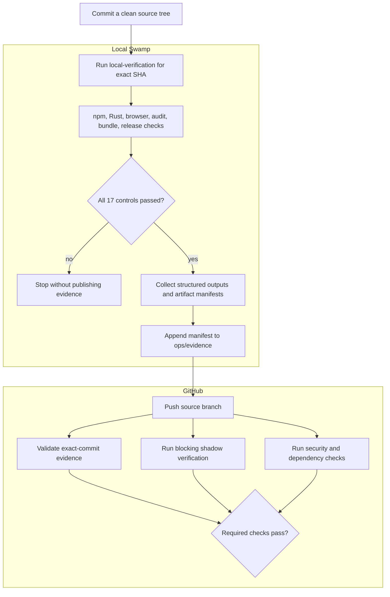

# Swamp verification system for herdr-mise

This document is the operational reference for the Swamp workflow and its
boundary with GitHub CI. It covers the committed models, model types, workflow,
evidence format, protected branches, remote checks, trust assumptions, and
recovery procedures used by `herdr-mise`.

For the short contributor runbook, see
[`docs/local-verification.md`](docs/local-verification.md).

## Scope

Swamp serves three purposes in this repository:

1. Run the deterministic npm, Rust, browser, audit, bundle, and release
   validation controls against one exact clean Git commit.
2. Collect the structured outputs and artifact manifests from that run into a
   commit-bound evidence document.
3. Publish the document to the protected `ops/evidence` branch for fast,
   independent validation by GitHub CI.

Swamp does not merge pull requests, approve changes, manage GitHub repository
settings, sign releases, publish artifacts, or replace remote security scans.

## System boundary

The system separates local execution from remote enforcement:

- The developer commits the source and manually runs `local-verification` for
  that exact commit.
- Swamp runs the controls, stores structured method data, builds a manifest,
  and appends it to `ops/evidence`.
- GitHub's `Local verification evidence` job checks the pull-request head and
  independently validates the matching manifest.
- GitHub's blocking shadow job reruns the full suite on a hosted runner while
  the evidence design is being proven.
- CodeQL, dependency review, Gitleaks, Rust advisory scanning, Herdr
  compatibility drift detection, release matrix builds, signing, notarization,
  publication, and public artifact checks remain remote controls.



The evidence is a durable claim made by the local environment. Git and the
manifest hashes make that claim tamper-evident; they do not prove that an
untrusted local machine honestly executed the commands. The remote controls
define the remaining trust boundary.

## Repository layout

| Path                                         | Purpose                                                           | Version controlled |
| -------------------------------------------- | ----------------------------------------------------------------- | ------------------ |
| `.swamp.yaml`                                | Swamp repository identity and managed-tool metadata               | Yes                |
| `AGENTS.md`                                  | Agent policy for operating Swamp in this repository               | Yes                |
| `models/`                                    | Persistent model instances used by the workflow                   | Yes                |
| `workflows/`                                 | Declarative workflow definitions                                  | Yes                |
| `extensions/models/`                         | Project-specific model types                                      | Yes                |
| `extensions/models/upstream_extensions.json` | Pulled extension versions and checksums                           | Yes                |
| `verification/policy.json`                   | Authoritative evidence controls and configuration inputs          | Yes                |
| `scripts/verification-evidence.mjs`          | Independent CI evidence validator                                 | Yes                |
| `scripts/verification-evidence.test.mjs`     | Fail-closed validator regression tests                            | Yes                |
| `scripts/workflow-contract.test.mjs`         | GitHub workflow and supply-chain contract tests                   | Yes                |
| `docs/local-verification.md`                 | Short contributor runbook                                         | Yes                |
| `.swamp/`                                    | Bundles, model data, run records, and the local evidence checkout | No                 |

The Swamp repository ID is `4e456edf-521e-4700-80aa-3c670ba49087`.

## Component inventory

### Models

A model is a named instance of a typed capability. The workflow calls model
methods; it does not invoke ad hoc shell integration wrappers.

| Model                       | Type                               | Purpose                                                                | Definition                                                           |
| --------------------------- | ---------------------------------- | ---------------------------------------------------------------------- | -------------------------------------------------------------------- |
| `verification-root`         | `@funsaized/npm/project`           | Install root dependencies and run allowlisted npm verification scripts | `models/@funsaized/npm/project/verification-root.yaml`               |
| `verification-client`       | `@funsaized/npm/project`           | Install locked client dependencies                                     | `models/@funsaized/npm/project/verification-client.yaml`             |
| `verification-rust`         | `@funsaized/herdr-mise-rust`       | Run commit-bound fallback and production Rust checks                   | `models/@funsaized/herdr-mise-rust/verification-rust.yaml`           |
| `verification-evidence`     | `@funsaized/verification-evidence` | Collect current-run data and create the canonical evidence manifest    | `models/@funsaized/verification-evidence/verification-evidence.yaml` |
| `verification-evidence-git` | `@swamp/git`                       | Operate the dedicated evidence checkout                                | `models/@swamp/git/verification-evidence-git.yaml`                   |

List or inspect the models:

```bash
swamp model search --json
swamp model get verification-root --json
swamp model validate verification-root --json
```

### Model types

| Extension                          | Version        | Source                                       | Used capability                                     |
| ---------------------------------- | -------------- | -------------------------------------------- | --------------------------------------------------- |
| `@funsaized/npm`                   | `2026.08.26.3` | Swamp registry                               | Commit-bound npm `ci` and allowlisted `run` methods |
| `@swamp/git`                       | `2026.08.25.1` | Swamp registry                               | Structured pull, commit, and push operations        |
| `@funsaized/herdr-mise-rust`       | `2026.08.27.1` | `extensions/models/herdr_mise_rust.ts`       | Project-specific Rust verification                  |
| `@funsaized/verification-evidence` | `2026.08.27.1` | `extensions/models/verification_evidence.ts` | Evidence collection and hashing                     |

Registry extension versions and integrity checksums are recorded in
`extensions/models/upstream_extensions.json`. Pulled sources and bundles live
under ignored `.swamp/` runtime state.

Verify the installed extension registry:

```bash
swamp doctor extensions --json
```

### Rust verification type

`@funsaized/herdr-mise-rust` exposes two methods:

```text
fallbackAssets(expectedGitHead)
verify(expectedGitHead)
```

`fallbackAssets` removes generated `client/dist` files and runs locked workspace
tests against the fallback assets. `verify` runs Rust formatting, locked
workspace checking, and locked workspace tests after production assets exist.

Both methods require the supplied SHA to equal `HEAD`, require a clean worktree,
record the Cargo lockfile digest and toolchain versions, and fail if the
repository changes during execution.

### Evidence collection type

`@funsaized/verification-evidence` exposes:

```text
collect(commit, runId)
```

It reads only model data tagged with the current workflow run ID and expected
step, verifies the output set and structured result for every policy control,
hashes the configured source files and artifacts, and writes one new manifest.
It refuses a dirty source tree, a dirty evidence checkout, the wrong evidence
branch, path escapes, symlinks, duplicate destinations, and manifests larger
than 2 MiB.

### Vaults and secrets

This Swamp system has no vault and consumes no secret values. Authentication
for the evidence push comes from the developer's existing Git credentials.
Release credentials remain GitHub Actions secrets and are outside Swamp.

## Local verification workflow

The sole workflow is `local-verification`, defined in
`workflows/workflow-local-verification.yaml`. It has one required input:

```text
commit: exact 40-character lowercase Git SHA
```

It has no schedule or remote trigger. Run it manually after committing all
source changes:

```bash
swamp workflow validate local-verification --json
swamp workflow run local-verification \
  --input commit=$(git rev-parse HEAD) \
  --json
```

The source worktree must remain clean throughout the run. A wrong SHA or a
tracked change stops the workflow before evidence publication.

### Workflow DAG

The workflow is a fail-fast linear chain. It contains 17 verification controls
followed by four publication steps:

```mermaid
flowchart LR
    A["root npm ci"] --> B["client npm ci"]
    B --> C["install Chromium"]
    C --> D["fallback Rust tests"]
    D --> E["format and build"]
    E --> F["Rust fmt, check, test"]
    F --> G["typecheck, lint, unit tests"]
    G --> H["compatibility and visual tests"]
    H --> I["token, accessibility, bundle-budget checks"]
    I --> J["bundle and release validation"]
    J --> K["fast-forward evidence checkout"]
    K --> L["collect manifest"]
    L --> M["commit evidence"]
    M --> N["non-force push ops/evidence"]
```



The exact step names, model IDs, methods, arguments, expected outputs, artifact
roots, and configuration inputs are authoritative in
`verification/policy.json`. The workflow and CI contract tests reject drift
between the intended controls and their implementations.

## Evidence branch and format

`ops/evidence` is an orphan branch containing only append-only records:

```text
evidence/v1/<source-commit>/<workflow-run-id>/manifest.json
```

Each manifest contains:

- the exact source commit and Git tree SHA;
- the workflow ID, name, and run ID;
- SHA-256 digests of every verification configuration file;
- every required model, method, status, and exact Swamp output record;
- the size, SHA-256 digest, and base64 bytes of each embedded output;
- sorted file manifests for `client/dist` and `target/release/herdr-mise`;
- a pass verdict and creation timestamp;
- a canonical SHA-256 root over the complete unsigned document.

Large artifacts, dependency directories, and Cargo build directories are not
stored on `ops/evidence`. Their file names, sizes, executable bits, and hashes
are retained. Trusted release infrastructure independently builds and verifies
the shipped artifacts.

The `local-verification` workflow calls the Git model with `ffOnly: true`,
`force: false`, and `forceWithLease: false`. The generic `@swamp/git` type still
offers force and amend operations; protected-branch settings are the external
rewrite brake. New runs create new directories rather than replacing previous
records.

## GitHub CI boundary

The three jobs in `.github/workflows/ci.yml` are independent and run
concurrently:

| Job                                             | Role                                                         |
| ----------------------------------------------- | ------------------------------------------------------------ |
| `Local verification evidence`                   | Validate the local claim against the exact source commit     |
| `Shadow full verification (blocking migration)` | Independently rerun the deterministic suite during migration |
| `rust-advisories`                               | Install pinned `cargo-audit` and scan `Cargo.lock`           |

Other trusted controls live in separate GitHub workflows with their own
triggers:

| Workflow                    | Trigger and role                                                                               |
| --------------------------- | ---------------------------------------------------------------------------------------------- |
| `CodeQL`                    | Analyze JavaScript/TypeScript and Rust on pull requests and non-evidence pushes                |
| `Dependency review`         | Reject pull-request dependency changes at moderate severity or higher                          |
| `Gitleaks`                  | Scan the commit range for every push and pull request                                          |
| `Herdr compatibility drift` | Check pinned upstream Herdr sources weekly or on manual dispatch                               |
| `Release`                   | Run path-filtered PR builds; sign, notarize, publish, and publicly verify only on release tags |

### Evidence event matrix

| Event                              | Evidence subject                     | Evidence job                                        |
| ---------------------------------- | ------------------------------------ | --------------------------------------------------- |
| Pull request                       | `github.event.pull_request.head.sha` | Required for merge by branch protection             |
| Push to a non-`main` source branch | `github.sha`                         | Runs and fails that workflow run if invalid         |
| Push to `main` after merge         | Newly created `github.sha`           | Skipped                                             |
| Push to `ops/evidence`             | Not applicable                       | Push trigger for the entire CI workflow is excluded |

Pull-request evidence intentionally binds to the source head rather than
GitHub's synthetic merge ref. A squash or merge operation creates a new commit
SHA only after the pull-request checks pass. Exact-commit evidence cannot exist
for that post-merge SHA beforehand, so the evidence job skips `main` pushes.
The shadow, Rust advisory, CodeQL, and Gitleaks controls still execute against
the resulting `main` commit.

`ops/evidence` push events are excluded from the CI and CodeQL workflows to
avoid a verification loop; their pull-request triggers are not branch-filtered.
Gitleaks still scans all pushes, including evidence pushes.

### What the evidence job validates

The job checks out the pull-request head and `ops/evidence` separately, then
runs `scripts/verification-evidence.mjs`. It rejects evidence unless all of the
following hold:

- the checked-out source SHA, manifest source SHA, and source tree match;
- the workflow identity and required control order match policy;
- the evidence is no more than 24 hours old and not from the future;
- all configuration digests match the checked-out source;
- every expected output exists and passes its size and SHA-256 checks;
- npm commands, project directories, clean-tree state, and lockfiles match;
- Rust check names, statuses, commit, and Cargo lockfile match;
- artifact roots and sorted file manifests are complete;
- the canonical evidence root is valid.

The validator lists candidate manifests for the source commit in reverse path
order and accepts the first valid candidate. Missing or wholly invalid evidence
fails closed.

### Shadow verification

The shadow job repeats the deterministic controls directly on a GitHub-hosted
runner. It is not informational: it remains a required, blocking check.

A shadow failure after a successful local workflow is a CI escape. Treat it as
a defect in local reproducibility, evidence coverage, or environment parity.
Do not remove the shadow job until a useful sample of runs has zero unexplained
escapes. Restore it if escapes appear after migration.

The eventual target boundary is:

- local Swamp execution plus fast evidence validation for deterministic checks;
- remote security, dependency, release, signing, and public acceptance checks;
- no duplicated full remote suite once the migration has enough evidence.

## Branch protections

### `main`

GitHub currently requires the branch to be up to date and requires these check
contexts before merge:

```text
Local verification evidence
Shadow full verification (blocking migration)
rust-advisories
review
scan
CodeQL
```

Administrators are included. Linear history and conversation resolution are
required; force pushes and branch deletion are disabled.

`.github/CODEOWNERS` assigns verification policy paths to `@funsaized`, but the
current branch protection does not require an approving review or enforce code
owner review. Treat changes to workflows, models, extensions, policy, and the
validator as trust-boundary changes even when GitHub does not demand approval.

### `ops/evidence`

Administrators are included. Linear history is required; force pushes and
branch deletion are disabled. The branch has no required status checks because
the local workflow must be able to append evidence before the source PR check
runs.

Branch protection is GitHub runtime configuration, not repository source. Audit
it periodically because committed tests cannot detect settings drift.

## Data and reports

Model methods write versioned data records under ignored `.swamp/` runtime
state. Use Swamp commands rather than reading those files directly.

List runs and current-run data:

```bash
swamp workflow history search --json
swamp workflow history get local-verification --json
swamp workflow history logs local-verification --json
swamp data list --workflow local-verification --json
```

Retrieve generated reports:

```bash
swamp report get @swamp/workflow-summary \
  --workflow local-verification \
  --json

swamp report get @swamp/verification-attestation \
  --workflow local-verification \
  --json
```

Local run history is not shared by Git. The evidence manifest is the portable,
durable subset published for CI and audit.

## Contributor sequence

Use this order for every source update:

1. Commit all source changes and confirm the worktree is clean.
2. Validate the workflow definition.
3. Run `local-verification` for `git rev-parse HEAD`.
4. Confirm the workflow report shows 21 succeeded, 0 failed, and 0 skipped.
5. Optionally run the validator against the local evidence checkout.
6. Push the source branch and wait for GitHub checks.

```bash
test -z "$(git status --porcelain)"

swamp workflow validate local-verification --json
swamp workflow run local-verification \
  --input commit=$(git rev-parse HEAD) \
  --json

VERIFICATION_SOURCE_SHA=$(git rev-parse HEAD) \
VERIFICATION_EVIDENCE_DIR=.swamp/ops-evidence \
node scripts/verification-evidence.mjs
```

Any new commit, including a merge from `main`, invalidates prior evidence for
the source branch and requires a new workflow run before pushing that commit.

## Failure recovery

### Wrong SHA or dirty source tree

The first model method fails before useful verification and later steps skip.
Commit or remove the tracked changes, use the exact `git rev-parse HEAD` value,
inspect the workflow report, and start a new run. Do not publish evidence for a
different SHA.

### Evidence missing in a pull-request check

This usually means the source commit was pushed before its evidence or the
branch changed after verification. Run the workflow for the exact current head,
confirm that `ops/evidence` advanced, then rerun the failed GitHub evidence job.

### Shadow failed after local verification passed

Do not rerun until the difference is understood. Compare the failed GitHub step
with the matching Swamp output and record the case as a CI escape. Fix the
shared root cause, commit it, and produce new evidence.

### Evidence collection or push failed

Inspect the method and workflow reports before retrying:

```bash
swamp report get @swamp/method-summary \
  --model verification-evidence-git \
  --json

swamp report get @swamp/workflow-summary \
  --workflow local-verification \
  --json
```

Confirm the evidence checkout is clean and on `ops/evidence`. Never repair an
evidence failure with a force push or by deleting prior records.

### Method or workflow lock appears stale

```bash
swamp run history --active
swamp run doctor
```

Use `swamp run doctor --fix` only after reviewing the diagnosis.

### Post-merge `main` run

The evidence job should be skipped. The shadow and remote security checks still
run against the new `main` commit. A historical pre-fix run may remain red; do
not create post-hoc evidence merely to rewrite that historical result.

## New clone bootstrap

Committed definitions do not include pulled extension bundles or runtime data.
On a new clone:

```bash
npm ci

swamp extension install
swamp doctor extensions --json

swamp model validate verification-root --json
swamp model validate verification-client --json
swamp model validate verification-rust --json
swamp model validate verification-evidence --json
swamp model validate verification-evidence-git --json
swamp workflow validate local-verification --json
```

`swamp extension install` restores the versions recorded in
`extensions/models/upstream_extensions.json`. Use `swamp extension pull` only
when deliberately upgrading an extension and review the recorded version and
checksum change.

The local `ops/evidence` checkout is runtime state under `.swamp/`. The workflow
expects it to track the repository's protected `ops/evidence` branch.

## Validation commands

Repository checks:

```bash
npm test
npm run format:check
npm run typecheck
npm run lint
```

Local extension checks:

```bash
~/.swamp/deno/deno fmt --check extensions/models/*.ts

~/.swamp/deno/deno check \
  extensions/models/herdr_mise_rust.ts \
  extensions/models/verification_evidence.ts
```

Swamp checks:

```bash
swamp doctor extensions --json
swamp workflow validate local-verification --json
```

## Security properties and limits

- Evidence is bound to one clean source commit and tree; it is not reusable for
  a later commit with identical-looking changes.
- The append-only branch and canonical hashes expose mutation, but evidence is
  still a local execution claim rather than remote attestation.
- The evidence validator and policy are loaded from the proposed source commit.
  The blocking shadow job remains the independent execution backstop during
  migration.
- The npm models allow lifecycle scripts. They provide structured execution and
  commit binding, not sandboxing of dependency installation.
- Local toolchains are recorded but the npm models use `strictToolchain: false`;
  environment parity is monitored by the shadow run rather than guaranteed.
- Artifact manifests retain hashes and metadata, not release artifact bytes.
  Release infrastructure must rebuild and independently verify shipped files.
- `.swamp/` data and reports are local. Git shares definitions and published
  evidence, not the full local datastore.
- Swamp has no access to release signing or publication secrets.
- Old evidence is intentionally immutable. Corrections create new source and
  evidence commits rather than rewriting historical records.
- GitHub branch protection settings can drift independently of this repository;
  the settings described above require periodic external audit.
