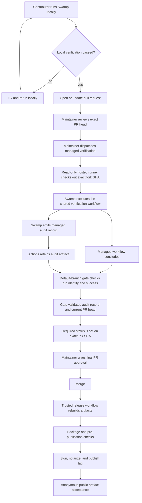

# Migrate to managed Swamp verification

This handoff plan moves pull-request verification from developer-published Git
evidence to maintainer-authorized execution on ephemeral managed runners. Swamp
remains the only implementation of the deterministic verification controls.
GitHub resolves the pull request, authorizes the run, verifies its conclusion
and exact source SHA, validates the resulting audit record, applies the merge
gate, and retains the record as an Actions artifact. The managed workflow
conclusion is the execution signal; the Swamp attestation is its structured
audit record, not independent proof that the commands honestly ran.

This is a migration plan, not a description of the current production path.
Until the cutover is complete, [`SWAMP.md`](../SWAMP.md) and
[`local-verification.md`](local-verification.md) remain authoritative for the
live `ops/evidence` flow.

## Target outcome

The completed system must provide this flow:



The target has five independent responsibilities:

| Responsibility                          | Owner                                                                        | Trust level                       |
| --------------------------------------- | ---------------------------------------------------------------------------- | --------------------------------- |
| Fast development feedback               | Contributor's local Swamp run                                                | Advisory                          |
| Managed execution signal                | Successful maintainer-authorized hosted workflow conclusion                  | Conventional managed CI           |
| Structured execution record             | Swamp attestation retained by Actions                                        | Audit data, not independent proof |
| Exact-SHA merge coordination            | Default-branch gate requiring both the managed signal and valid audit record | Trusted coordination              |
| Build, signing, publication, acceptance | Existing release workflow                                                    | Trusted release                   |

## Decisions

Implement these decisions unless the threat model changes:

1. Use GitHub-hosted runners as the first managed execution environment.
2. Use run-scoped GitHub Actions artifacts as the first attestation transport
   and retention mechanism. Artifacts are retention-bounded and deletable; they
   are not a WORM archive.
3. Do not add S3, a custom GitHub App, Sigstore, or a self-hosted runner during
   this migration.
4. Do not give an executor that runs pull-request code repository write access,
   cloud credentials, release credentials, signing material, or environment
   secrets.
5. Run one shared Swamp verification definition locally and on the managed
   executor. GitHub workflow YAML must not duplicate the npm and Rust control
   list.
6. Treat local attestations as advisory. Satisfy the merge gate only when a
   maintainer-authorized managed workflow succeeds for the current PR SHA and
   its bounded Swamp audit record validates. The record alone is never
   merge-authoritative.
7. Load the managed Swamp workflow, models, gate validator, and policy from
   trusted `main`, never from the pull request under validation. Pass the pull
   request as a separate subject checkout.
8. Route a pull request that changes verification trust-boundary files through
   the same managed executor under the old trusted `main` policy, but allow only
   the verification code owner to dispatch it. The proposed controls are
   subject data; they never validate themselves.
9. Rebuild release artifacts on trusted release infrastructure. Never promote a
   binary produced during pull-request verification.
10. Preserve the existing tag-only signing, notarization, stable acceptance, and
    anonymous public-release verification contracts.

## Current gaps

The current implementation already binds evidence to a clean source commit,
records structured Swamp outputs, hashes policy and configuration files, and
validates a canonical evidence root. The migration must correct these gaps:

| Gap                     | Current behavior                                                              | Required behavior                                                                                                  |
| ----------------------- | ----------------------------------------------------------------------------- | ------------------------------------------------------------------------------------------------------------------ |
| Third-party publication | The local workflow pushes `ops/evidence` with the developer's Git credentials | A third party needs no upstream write access                                                                       |
| Execution authority     | A local attestation is a claim from an untrusted machine                      | The managed execution signal is the conclusion of a maintainer-authorized hosted workflow bound to the current SHA |
| Attestation meaning     | A valid hash can be mistaken for proof of honest execution                    | The attestation records a managed run but does not independently prove it                                          |
| Policy provenance       | CI loads the validator and policy from the proposed source commit             | The gate loads them from trusted `main`                                                                            |
| Workflow privilege      | Collection and publication occur in one local workflow                        | Execution and privileged coordination are separate                                                                 |
| Maintainer decision     | The workflow assumes a contributor can publish evidence                       | A maintainer explicitly dispatches verification and separately approves merge                                      |
| Evidence transport      | An orphan Git branch is the handoff channel                                   | A run-scoped Actions artifact is the handoff channel                                                               |
| Duration evidence       | The manifest records results but not a complete timing contract               | Every step records start, completion, and duration                                                                 |
| Trust-boundary changes  | Proposed controls can participate in validating themselves                    | Proposed controls cannot become trusted until separately reviewed and merged                                       |

## Security boundary

### Managed executor

The managed executor runs pull-request code and must be treated as compromised
for the duration of the job. Resolve metadata and execute the subject in
different jobs. The resolver may read repository and pull-request metadata. The
executor uses `permissions: {}` and an unauthenticated fetch of the already
validated public repository and SHA. `actions/upload-artifact` uses its
run-scoped artifact credential; it does not require a repository-scoped write
grant.

Required properties:

| Property                    | Requirement                                                                                        |
| --------------------------- | -------------------------------------------------------------------------------------------------- |
| Trigger                     | `workflow_dispatch` from `main` with a pull-request number                                         |
| Authorization               | GitHub permits only repository writers to dispatch; the workflow also records and checks the actor |
| Source                      | Current head repository and immutable head SHA resolved from GitHub's API                          |
| Control checkout            | Exact trusted `main` commit that supplied the dispatch workflow                                    |
| Subject checkout            | Exact head SHA fetched without persisted GitHub credentials                                        |
| Resolver permissions        | `contents: read`, `pull-requests: read`                                                            |
| Executor permissions        | `{}`                                                                                               |
| Secrets                     | None                                                                                               |
| AWS or other cloud identity | None                                                                                               |
| Release/signing identity    | None                                                                                               |
| Runtime                     | Fresh GitHub-hosted runner                                                                         |
| Output                      | Separate fixed-name request and attestation artifacts                                              |

The workflow must resolve the PR head and current upstream `main` SHA at run
time. It must not accept a branch name, base SHA, or contributor-supplied
repository URL as authoritative input. The resolver passes immutable IDs and
SHAs to the executor. The executor fetches both commits with full ancestry; it
must not rely on a fork's `origin/main`.

### Trusted gate

The gate is a separate `workflow_run` workflow stored on `main`. It may read
Actions artifacts and set one commit status. It must never execute, import, or
source pull-request content.

Required properties:

| Property           | Requirement                                                                                                    |
| ------------------ | -------------------------------------------------------------------------------------------------------------- |
| Trigger            | Completion of the named managed verification workflow, followed by an event-only workflow identity check       |
| Trusted code       | Validator and policy checked out from `main`                                                                   |
| Untrusted input    | Manifest and request metadata parsed as bounded data only                                                      |
| GitHub permissions | `actions: read`, `contents: read`, `pull-requests: read`, `statuses: write`                                    |
| Status context     | `Swamp managed verification`                                                                                   |
| Status target      | Current PR head SHA resolved through GitHub, after confirming the request and attestation name the same SHA    |
| Failure behavior   | Fail closed; never publish success for a failed run or absent, stale, moved, malformed, or incomplete evidence |

Do not use `pull_request_target`. Do not combine the executor and gate into one
privileged workflow. Do not run downloaded files or commands named by the
attestation.

`workflow_run.workflows` filters by workflow name, which is not a sufficient
identity boundary. Before downloading artifacts, query the Actions API with the
event's immutable workflow ID and require all of these event-derived values:

```text
workflow ID and path: trusted managed executor on main
event: workflow_dispatch
head branch: main
head SHA: recorded trusted control SHA
triggering actor: recorded dispatcher
```

Do not use manifest fields to establish the workflow's identity; the manifest
is untrusted input.

### Assurance limit

The managed execution signal is the successful conclusion of the trusted
workflow bound to the current PR SHA. The gate publishes the merge-required
status only when that signal and a valid audit record agree. The attestation adds
machine-readable audit detail and tamper detection after publication; it does
not add an independent source of execution truth. A SHA-256 digest proves only
that the retained bytes have not changed since they were hashed.

This target provides conventional hosted-CI assurance, not cryptographic proof
that every command honestly ran. Its stronger assurance over a contributor
laptop comes from trusted workflow identity, maintainer authorization,
ephemeral infrastructure, no privileged credentials in the subject job, exact
source/base binding, independent gate coordination, maintainer review, and
release acceptance. A malicious dependency, test, or build script still
executes beside the Swamp process and may interfere with same-run state.

Do not describe the target as tamper-proof. If the threat model later requires
the subject process to be unable to modify Swamp runtime state, add a trusted
outer verifier and an inner container or microVM, with no host socket, no cloud
metadata, a read-only control mount, and bounded result transport. That is a
separate hardening phase, not part of this migration.

### Trust-boundary paths

The resolver classifies a pull request as a trust-boundary change when it
changes any matching path:

```text
.github/CODEOWNERS
.github/workflows/**
.gitignore
.oxfmtrc.json
.swamp.yaml
AGENTS.md
extensions/models/**
extensions/tests/**
models/**
scripts/verification-evidence.mjs
scripts/verification-evidence.test.mjs
scripts/install-swamp-managed.sh
scripts/managed-verification-evidence.mjs
scripts/workflow-contract.test.mjs
verification/**
workflows/**
```

Lockfiles, package manifests, application tests, source files, and release notes
remain valid pull-request changes. Their bytes are attested and reviewed, but
they are not the trusted gate implementation.

For an ordinary PR, a maintainer dispatch is the authorization. For a
trust-boundary PR, the resolver requires the dispatcher to be the allowlisted
verification code owner (`@funsaized`). The executor then runs trusted controls
from `main` against the proposed source. The required status can therefore pass
without letting proposed policy validate itself and without creating a branch
protection exception.

When the list changes, update `.github/CODEOWNERS`, the resolver, the workflow
contract test, and this document in the same trust-boundary change.

## Managed attestation contract

Introduce schema version 2 rather than silently extending schema version 1.
This attestation is the managed run's audit record, not its source of execution
authority. It must contain these top-level sections:

```json
{
  "schemaVersion": 2,
  "source": {},
  "base": {},
  "control": {},
  "producer": {},
  "workflow": {},
  "configuration": {},
  "steps": [],
  "artifacts": [],
  "verdict": "pass",
  "createdAt": "...",
  "evidenceRootSha256": "..."
}
```

Required identity fields:

| Section         | Fields                                                                                      |
| --------------- | ------------------------------------------------------------------------------------------- |
| `source`        | Repository owner/name, immutable repository ID when available, commit SHA, tree SHA         |
| `base`          | Repository, branch `main`, commit SHA observed by the managed run                           |
| `control`       | Trusted repository, commit SHA, policy digest, workflow digest, Swamp version               |
| `producer`      | `kind`, GitHub repository, workflow path, workflow ref, run ID, run attempt, dispatch actor |
| `workflow`      | Swamp workflow ID, workflow name, Swamp run ID                                              |
| `configuration` | `sha256` algorithm plus sorted path-to-digest map                                           |
| `steps[]`       | Name, model name/type, method, status, start time, completion time, duration, exact records |
| `artifacts[]`   | Root and sorted file path, size, executable bit, SHA-256 entries                            |

Use these producer values:

```text
local                 advisory developer run
github-actions        audit record from a managed run
```

The gate must reject `producer.kind: local`. A local run can use the same schema
and validator for developer feedback, but it cannot set the required status. A
structurally valid `github-actions` record also cannot set success unless the
matching trusted managed workflow concluded successfully for the current PR
head.

Preserve the existing 2 MiB manifest limit, exact output-set validation,
canonical JSON hashing, 24-hour freshness, source tree check, lockfile checks,
clean worktree checks, and artifact manifest validation. The validator also
requires every step to have valid start/completion timestamps and non-negative
duration recorded by the trusted Swamp collector. The collector must not read a
timing claim from the subject repository, but same-job subject code may still
interfere with runtime state, so timing remains audit metadata rather than proof.

The gate performs these correlations against trusted `workflow_run` event data,
GitHub API results, resolver metadata, and current repository state. Manifest
fields are compared with those sources but never establish them:

1. The producer workflow path and ref match the allowlisted managed workflow on
   `main`.
2. The producer run ID and attempt match the triggering `workflow_run` event.
3. The dispatch actor matches the triggering actor GitHub authorized to invoke
   `workflow_dispatch`; do not add a second collaborator-permission API
   dependency.
4. The trusted control SHA matches the triggering workflow run's main-branch
   SHA.
5. The attested source repository and SHA match immutable resolver metadata.
6. The source SHA is still the open pull request's current head.
7. The attested base SHA still equals current upstream `main`.
8. The pull request still targets `main`.
9. A trust-boundary run records an allowlisted code-owner dispatcher.
10. The triggering managed workflow concluded successfully.

## Repository changes

The implementation is expected to touch these files. Keep unrelated release and
product code out of the migration.

| Path                                                                 | Change                                                                                                                                       |
| -------------------------------------------------------------------- | -------------------------------------------------------------------------------------------------------------------------------------------- |
| `workflows/workflow-verification.yaml`                               | New shared verification and collection workflow without Git publication                                                                      |
| `workflows/workflow-local-verification.yaml`                         | Retain only during transition; remove after the new path is required                                                                         |
| Verification model types and instances                               | Accept an explicit, path-bounded subject root while definitions and policy remain in the trusted control repository                          |
| `extensions/models/verification_evidence.ts`                         | Keep legacy `collect` temporarily; add managed schema v2 collection with timing, producer, control, base, and neutral output path            |
| `models/@funsaized/verification-evidence/verification-evidence.yaml` | Configure trusted policy root and a separate subject/output root                                                                             |
| `verification/policy.json`                                           | Keep the live schema v1 policy unchanged until the legacy gate is retired                                                                    |
| `verification/managed-policy.json`                                   | Temporary schema v2 managed workflow, producer, trust-path, and required-step policy during coexistence                                      |
| `scripts/verification-evidence.mjs`                                  | Keep the live schema v1 CLI behavior unchanged during coexistence                                                                            |
| `scripts/managed-verification-evidence.mjs`                          | Validate schema v2 with separate trusted policy, subject checkout, and artifact paths                                                        |
| `scripts/verification-evidence.test.mjs`                             | Add schema v2 and managed-producer attack cases                                                                                              |
| `scripts/install-swamp-managed.sh`                                   | Install the `.swamp.yaml` version from an immutable official artifact and verify its committed digest before any subject execution           |
| `scripts/workflow-contract.test.mjs`                                 | Enforce workflow separation, permissions, triggers, pins, status context, and forbidden privileged execution                                 |
| `.github/workflows/swamp-managed-verification.yml`                   | Resolve and execute one maintainer-authorized exact-SHA managed run                                                                          |
| `.github/workflows/swamp-managed-gate.yml`                           | Validate the completed run and set exact-SHA status                                                                                          |
| `.github/workflows/ci.yml`                                           | Keep shadow, legacy evidence, and security checks through cutover; remove the legacy evidence job only after its required context is removed |
| `.github/CODEOWNERS`                                                 | Cover every trust-boundary path and this plan                                                                                                |
| `docs/local-verification.md`                                         | Replace Git-publish instructions with local advisory and maintainer-dispatch instructions                                                    |
| `SWAMP.md`                                                           | Replace the old system boundary, components, recovery, and limits after cutover                                                              |
| `AGENTS.md`                                                          | Replace `local-verification` scheduling rules with the shared workflow and managed gate contract                                             |

The current release implementation already separates tag-only publication,
signing/notarization, stable acceptance, and anonymous public verification. Do
not fold those jobs into Swamp pull-request verification.

## Implementation phases

### Phase 0: protect the migration

Before changing runtime behavior, account for the repository's current single
maintainer. GitHub does not permit an author to approve their own pull request,
so requiring one approval would deadlock owner-authored trust changes while
administrators are subject to protection.

1. Keep administrators subject to branch protection.
2. Keep required approval count at zero while `@funsaized` is the only trusted
   maintainer; use exact-SHA dispatch and owner-controlled merge as the
   enforceable human decisions.
3. Require one approval, code-owner review, stale dismissal, and latest-push
   approval as soon as a second trusted maintainer is added.
4. Add this document and all planned trust paths to `.github/CODEOWNERS` now so
   ownership is visible even before enforcement is possible.
5. Record the live branch-protection JSON before changes for rollback.

Acceptance criteria:

```text
A third party cannot dispatch trust-boundary verification or merge without @funsaized.
A new commit loses the old managed status and requires a new dispatch.
Existing required checks remain enforced.
```

Rollback: restore the recorded branch-protection configuration. Do not change
source code in this phase.

### Phase 1: define schema v2

Implement schema v2 in the collector and validator before adding managed
workflows.

1. Inspect the existing `@swamp/verification-attestation` report first. Reuse or
   extend it if it exposes the required exact records and step timing; otherwise
   record why the project collector remains necessary.
2. Keep the existing `collect` method and schema v1 validator unchanged for the
   live `ops/evidence` gate.
3. Add a temporary distinct `collectManaged` method for schema v2 so the canary
   cannot break the live gate.
4. Keep `verification/policy.json` and the default
   `scripts/verification-evidence.mjs` CLI on schema v1 during coexistence.
5. Add `verification/managed-policy.json` and
   `scripts/managed-verification-evidence.mjs` for schema v2. Shared pure helper
   functions are allowed, but neither entrypoint may silently select the other
   schema.
6. Add producer, control, base, timing, and GitHub-run identity fields.
7. Write the managed manifest to a neutral ignored path such as
   `.swamp/verification-output/manifest.json`.
8. Have the trusted Swamp collector record step timing from run metadata or
   structured model output. Extend a model result when timing is absent; do not
   infer duration from manifest creation time or treat timing as proof that the
   subject could not interfere.
9. Preserve deterministic field ordering and the canonical evidence root.
10. Add fixtures for both versions during the migration window.
11. Delete legacy `collect`, the managed coexistence naming, and schema v1
    validation only after the old gate is retired. Consolidate to one clearly
    named schema v2 policy and validator then.

Acceptance criteria:

```text
Schema v2 output is deterministic for fixed fixture data.
Every required step includes valid timing.
Local producer evidence validates as structurally sound but is ineligible for the managed gate.
Malformed, oversized, duplicated, stale, or identity-mismatched evidence fails closed.
```

Rollback: remove or stop calling `collectManaged`; continue generating schema v1
and leave the existing evidence branch gate required.

### Phase 2: create the shared Swamp workflow

Create `verification` through `swamp workflow create verification`; preserve the
assigned ID. Do not hand-author an ID. This is the one reusable Swamp workflow
that performs source preflight, all deterministic controls, and neutral
attestation collection. It must not commit or push an evidence repository.

1. Before editing extensions, run `swamp model type describe` for every current
   model type. Extend an existing type when it lacks a subject-root input.
2. Add a path-bounded `subjectRoot` to Git, npm, Rust, and evidence operations.
   Resolve the control and subject checkouts as sibling directories under the
   runner's temporary root. Canonicalize both, reject symlinks and path escape,
   and require that neither root contains the other.
3. Copy the current required control sequence without changing its order.
4. Replace remote-name lookup with explicit `commit` and `baseCommit` inputs.
   Require `baseCommit` to be an ancestor of `commit`; do not infer upstream
   `main` from the subject clone's `origin`.
5. Preserve locked installs and clean-worktree requirements in the subject.
6. Collect schema v2 evidence only after every required control succeeds.
7. Make `commit`, `baseCommit`, `subjectRoot`, and producer metadata explicit
   typed inputs.
8. Keep all model invocations in Swamp; do not reproduce commands in GitHub
   workflow YAML.
9. Run the workflow definition from the trusted control checkout and execute
   project commands only in `subjectRoot`.

Target command:

```sh
swamp workflow validate verification
swamp workflow run verification \
  --input commit=$(git rev-parse HEAD) \
  --input baseCommit=$(git rev-parse upstream/main) \
  --input subjectRoot=.
```

Contributor setup must define `upstream` as the canonical repository. If the
remote is absent, stop with onboarding instructions rather than substituting
`origin`.

Acceptance criteria:

```text
swamp workflow validate verification succeeds.
The evaluated workflow contains the required source preflight and control order.
A fork's origin is never treated as canonical main.
The supplied upstream base commit is present and is an ancestor of the subject commit.
A failed control prevents collection.
A successful run creates exactly one schema v2 manifest.
The workflow performs no Git push and requires no upstream write access.
```

Rollback: leave the existing `local-verification` workflow and branch publisher
unchanged and non-deprecated.

### Phase 3: add the managed executor

Add `.github/workflows/swamp-managed-verification.yml` on `main`.

Pin the workflow name, workflow file path, and resulting status context in
`scripts/workflow-contract.test.mjs`. Use `ubuntu-24.04`, a 60-minute executor
timeout, full-SHA action references with readable version comments, and
cancellable concurrency keyed by the numeric PR number.

Before enabling the executor, add a trusted Swamp bootstrap. It must read the
version from trusted `.swamp.yaml`, download an immutable official artifact,
verify a committed SHA-256 digest, and print the installed version. If no
official immutable artifact and checksum are available, stop this phase and
document the supported installation mechanism; do not use an unpinned install
script.

The workflow accepts only a decimal `prNumber` string. Pass it through an
environment variable to trusted code; never interpolate it directly into a
shell program. Its trusted resolver job must:

1. Assert the event is `workflow_dispatch`, `github.ref` is `refs/heads/main`,
   and the run's workflow ID/path match the allowlisted executor.
2. Validate `prNumber` as digits only and fetch the open PR through GitHub's
   API.
3. Require base repository `funsaized/herdr-mise` and base branch `main`.
4. Resolve current upstream `main` independently and require it to equal the
   PR's current base SHA before starting.
5. Record head repository ID/name, exact head SHA, upstream base SHA, PR number,
   actor, trusted control SHA, workflow ID, workflow run ID, and run attempt in
   request metadata.
6. Classify trust-boundary changes from the GitHub file list and the exact Git
   diff. For that class, require the dispatcher login to equal the allowlisted
   verification code owner before execution.
7. Upload request metadata first under a fixed artifact name with overwrite
   disabled. Artifact v4 names are immutable within one run but remain deletable
   under repository retention policy. This prevents accidental replacement; it
   is not proof against a hostile process in the executor security domain.

Use these exact artifact names so the contract test and gate agree:

```text
swamp-managed-request
swamp-managed-attestation
swamp-managed-diagnostics
```

The executor job must have `permissions: {}` and must not inherit an environment
or secrets. It must:

1. Fetch the exact trusted control SHA from the public canonical repository
   without a GitHub credential; do not load Swamp definitions, models, policy,
   validator, or installer from the subject.
2. Fetch the validated public head repository and exact SHA without a GitHub
   credential, with hooks disabled and without recursively fetching submodules.
3. Fetch the exact upstream base SHA and enough history to evaluate ancestry.
   Use `fetch-depth: 0` where `actions/checkout` participates; never rely on its
   default depth of one.
4. Reconfirm subject `HEAD`, tree, upstream base, and ancestry before Swamp runs.
5. Install the pinned Swamp/toolchain versions from the trusted control checkout.
6. Run `verification` from the control checkout with the separate subject root,
   head SHA, base SHA, and managed producer metadata.
7. Upload the bounded manifest under a second fixed artifact name with overwrite
   disabled.
8. Upload sanitized diagnostics on failure under a third fixed name without
   including secrets or private paths.

Do not grant the executor job `contents`, `pull-requests`, `statuses`,
`id-token`, or any secret. The resolver has read-only metadata permissions and
cannot set statuses. Update `scripts/workflow-contract.test.mjs` with the exact
allowed permission map; its current all-workflow `contents: read` rule must not
be weakened into an open-ended exception.

Acceptance criteria:

```text
An external fork PR can be verified without upstream branch access.
Only a repository writer can initiate the run.
The run checks out the exact recorded SHA.
The job cannot push source, evidence, tags, statuses, or releases.
Trust-boundary changes run only when dispatched by the verification code owner and use old trusted controls.
The control checkout and subject checkout are distinct.
Both exact commits are present, and base is an ancestor of head.
The Actions artifact exists after success and names the exact PR SHA.
```

Rollback: disable the managed workflow. The existing local evidence and shadow
checks remain authoritative.

### Phase 4: add the trusted gate

Add `.github/workflows/swamp-managed-gate.yml` on `main` with a `workflow_run`
trigger restricted to the managed executor's workflow name.

The gate must:

1. Before artifact access, require event-derived `workflow_run.event ==
workflow_dispatch`, `head_branch == main`, the allowlisted immutable workflow
   ID/path, and the expected trusted control SHA relationship. Record the
   event-derived conclusion and never set success unless it is `success`.
2. Query artifacts for the exact triggering run ID. Require exactly one request
   artifact and, after success, exactly one attestation artifact with the fixed
   names. Never use the gate run's default artifact scope.
3. Download request metadata and the attestation into a temporary data-only
   directory using `run-id: ${{ github.event.workflow_run.id }}`.
4. Fetch the recorded trusted control SHA from the public canonical repository
   without a GitHub credential; resolve current `main` independently for
   staleness.
5. Resolve the PR and upstream `main` again. Require the recorded source to
   remain the current PR head and the recorded base to remain current `main`.
6. Passively fetch the exact subject SHA with hooks disabled, no submodules, and
   persisted credentials disabled.
7. Run the trusted validator from `main`, passing three explicit roots: trusted
   policy/control, passive subject checkout, and downloaded artifact directory.
   The validator must not derive any root from `import.meta.url` implicitly.
8. Compare producer run ID, attempt, actor, immutable workflow ID/path, control
   SHA, and workflow ref to event-derived and API-derived values.
9. Set `Swamp managed verification` success only when the trusted managed run
   concluded successfully and every identity, freshness, and audit-record check
   passes.
10. Set failure on the recorded SHA when trusted request identity exists but
    verification or validation failed.
11. Avoid setting any status when request identity cannot be established safely.

The validator may read subject files to calculate hashes and Git identity. It
must not execute subject JavaScript, shell commands, package scripts, binaries,
or Git hooks.

Acceptance criteria:

```text
A successful trusted managed run with a valid audit record sets success on exactly one current PR SHA.
A moved PR head cannot inherit success.
A local attestation cannot set success.
A structurally valid attestation cannot set success by itself.
A successful-looking manifest from a failed managed run cannot set success.
A modified policy or validator in the PR cannot influence the gate.
Another workflow with the same display name cannot influence the gate.
An executor dispatched from a non-main ref cannot influence the gate.
The gate does not check out and execute pull-request code.
```

Rollback: remove `Swamp managed verification` from required checks before
disabling the gate. Leave the legacy evidence and shadow checks required.

### Phase 5: canary and cut over

Run the new path in parallel with the current branch evidence and shadow job.

1. Exercise at least one same-repository PR and one real or test fork PR.
2. Include one failed verification, one moved-head case, one non-owner
   trust-boundary rejection, and one code-owner-dispatched trust-boundary run
   under old trusted controls.
3. Compare every managed result with the existing shadow result.
4. Record mismatches as CI escapes; investigate rather than rerun blindly.
5. Add `Swamp managed verification` as a required `main` status after GitHub has
   observed the context.
6. Keep the legacy evidence and shadow checks required during the canary.
7. Confirm a new push clears the managed status and stale review.
8. Confirm the maintainer can dispatch a new run for the new SHA.

Cutover order matters:

```text
Deploy managed executor and gate.
Run canaries.
Require the managed status.
Confirm merge remains possible only with old and new checks.
Merge the workflow/documentation cutover with both gates passing; classify it as
a trust-boundary change and run it under old trusted controls after code-owner
dispatch.
Stop requiring Local verification evidence.
Retain the shadow job during the observation window.
```

Do not remove an old required status before the replacement has passed on a real
pull request. Do not delete `ops/evidence`; retain it as historical evidence.

Rollback during the canary: confirm the still-present `Local verification
evidence` and shadow contexts pass, remove the managed status requirement, then
disable the new workflows.

### Phase 6: assign acceptance and release controls

Keep source verification and shipped-outcome acceptance separate.

| Stage                   | Required controls                                                                                                  | Existing home                                              |
| ----------------------- | ------------------------------------------------------------------------------------------------------------------ | ---------------------------------------------------------- |
| Managed PR verification | Unit, integration, Rust, browser, visual, accessibility, compatibility, bundle, and release-layout checks          | Shared Swamp `verification` workflow                       |
| Trusted release build   | Three-platform release build, package validation, Apple signing and notarization                                   | `.github/workflows/release.yml`                            |
| Stable promotion        | Exact accepted RC and promotion evidence                                                                           | `docs/stable-acceptance.md` and release gate scripts       |
| Public acceptance       | Anonymous download, release class, exact asset count, checksum, extraction, signature, packaged smoke verification | `verify-public-release` in `.github/workflows/release.yml` |

The existing release workflow already rebuilds artifacts, verifies packages
before publication, and downloads public artifacts after publication. Preserve
those controls. Do not make release publication depend on pull-request build
bytes.

Add a post-merge acceptance workflow only if releases become infrequent enough
that failures would otherwise remain undiscovered on `main`. That workflow is
not required for the initial migration.

Acceptance criteria:

```text
No pull-request executor can access signing or publication secrets.
Release artifacts are rebuilt from the immutable tag.
Published artifacts pass anonymous public verification.
Stable publication continues to require the existing acceptance record.
```

Rollback: retain the current release workflow unchanged.

### Phase 7: retire legacy publication and shadow duplication

After the managed gate is stable:

1. Remove the `Local verification evidence` job from `ci.yml`.
2. Remove evidence-branch sync, commit, and push steps from Swamp workflows.
3. Remove `verification-evidence-git` if no remaining workflow uses it.
4. Stop writing new records to `ops/evidence`.
5. Keep `ops/evidence` protected and readable as historical evidence.
6. Update `SWAMP.md`, `docs/local-verification.md`, and `AGENTS.md` to describe
   only the new path.
7. Remove schema v1 generation and compatibility after no active branch depends
   on it.
8. Remove the shadow job only through a separate owner-approved trust-boundary
   change executed under the still-trusted managed policy.

The default shadow-retirement threshold is 20 successful managed runs with zero
unexplained escapes, including at least three fork PR runs, one failed-control
run, one moved-head rejection, and one trust-boundary rejection. This threshold
is an operational migration gate, not a claim that 20 runs prove correctness.

Acceptance criteria:

```text
The GitHub workflow files contain no duplicate npm/Rust verification command list.
No contributor workflow pushes an evidence branch.
The managed check remains required.
Security, dependency, release, and public acceptance checks remain remote.
The historical evidence branch cannot be force-pushed or deleted.
```

Rollback after legacy removal when the managed gate still works: use it to land
a trust-boundary restore commit, observe the restored legacy and shadow contexts
on a pull request, add them back to branch protection, and only then remove the
managed requirement. If the managed gate itself is broken, use the Phase 0
branch-protection snapshot as a settings-first break glass: remove only the
broken managed context, land the restore through the remaining protections,
observe the restored contexts, then reapply the intended protection. Do not
require a context before its workflow exists. Do not rewrite historical evidence
or force-update branches.

## Verification test plan

### Unit and contract tests

Add one focused fixture or mutation for each failure:

| Case                                                                     | Expected result                |
| ------------------------------------------------------------------------ | ------------------------------ |
| Correct managed manifest                                                 | Pass                           |
| `producer.kind: local`                                                   | Reject for managed gate        |
| Wrong source repository                                                  | Reject                         |
| Wrong source SHA or tree                                                 | Reject                         |
| PR head changed after execution                                          | Reject                         |
| PR closed or base changed                                                | Reject                         |
| Wrong managed workflow path or ref                                       | Reject                         |
| Wrong GitHub run ID or attempt                                           | Reject                         |
| Triggering event actor differs from recorded dispatcher                  | Reject                         |
| Workflow with same display name but wrong immutable ID/path              | Reject                         |
| Executor dispatched from non-main ref                                    | Reject                         |
| Triggering workflow failed                                               | Reject                         |
| Valid audit record without its matching trusted workflow run             | Reject                         |
| Trust-boundary file changed and dispatcher is not allowlisted code owner | Reject before execution        |
| Trust-boundary file changed and dispatcher is allowlisted code owner     | Run with trusted main controls |
| Missing, duplicate, reordered, skipped, or failed step                   | Reject                         |
| Step timestamp invalid or duration negative                              | Reject                         |
| Configuration digest mismatch                                            | Reject                         |
| Embedded record size or hash mismatch                                    | Reject                         |
| Artifact root or file manifest mismatch                                  | Reject                         |
| Stale or future timestamp                                                | Reject                         |
| Manifest exceeds 2 MiB                                                   | Reject                         |
| Canonical evidence root mismatch                                         | Reject                         |
| Privileged executor permission added                                     | Contract test fails            |
| `pull_request_target` added                                              | Contract test fails            |
| Mutable external action reference added                                  | Contract test fails            |
| Gate begins executing subject content                                    | Contract test fails            |
| Subject clone uses fork `origin/main` as base                            | Contract test fails            |
| Subject checkout is shallow for ancestry                                 | Contract test fails            |
| Gate downloads artifacts without triggering run ID                       | Contract test fails            |

### Repository checks

Run the narrow checks associated with modified files during implementation:

```sh
node --test scripts/verification-evidence.test.mjs
node --test scripts/workflow-contract.test.mjs
swamp model type describe @funsaized/npm/project --json
swamp model type describe @swamp/git --json
swamp workflow validate verification --json
swamp doctor extensions --json
```

Run broader repository checks only after the narrow contracts pass:

```sh
npm test
npm run format:check
npm run typecheck
npm run lint
```

Inspect generated method and workflow reports after any Swamp failure before
changing definitions or retrying.

### Live canary matrix

| Canary                                                      | Expected observation                                                      |
| ----------------------------------------------------------- | ------------------------------------------------------------------------- |
| Maintainer dispatches current fork PR                       | Managed run starts for exact fork SHA                                     |
| Non-writer attempts dispatch                                | GitHub refuses authorization                                              |
| Contributor pushes while run is active                      | Old run cannot set success on new SHA                                     |
| Verification command fails                                  | Gate sets failure on recorded SHA                                         |
| Manifest is manually corrupted                              | Gate rejects it                                                           |
| Non-owner dispatch of trust path changes                    | Executor stops before dependency installation                             |
| Code-owner dispatch of trust path changes                   | Executor uses old trusted controls; proposed controls remain passive data |
| Trusted managed run succeeds and its audit record validates | Required context succeeds on current SHA                                  |
| Release tag is created later                                | Release rebuilds; no PR artifact is reused                                |

## Operational runbook after cutover

For a normal contribution:

1. The contributor fetches canonical `upstream/main` and runs `swamp workflow
run verification` with exact head and upstream base SHAs until it passes.
2. The contributor pushes the unchanged verified commit and opens or updates the
   PR.
3. Security and dependency workflows run under their existing read-only
   contracts.
4. The maintainer reviews the diff and confirms no trust-boundary path changed.
5. The maintainer dispatches `Swamp managed verification` with the PR number.
6. The executor resolves and verifies the current head SHA.
7. The gate verifies the managed run identity and successful conclusion,
   validates its audit record, and sets the required status on the still-current
   PR head SHA.
8. The maintainer gives final approval where GitHub permits it and makes the
   final merge decision.
9. A new push at any point requires a new managed run and invalidates any prior
   review approval.

For a trust-boundary contribution:

1. Keep the existing shadow/full remote path required.
2. Require dispatch by the verification code owner; require a separate approval
   too once the repository has a second trusted maintainer.
3. Do not allow the proposed validator or policy to validate itself.
4. The code owner dispatches the managed executor; it runs old trusted `main`
   controls against the proposed source and can satisfy the same required
   status.
5. Merge the trust change separately after old-policy checks pass.
6. Rebase functional work onto the newly trusted `main`.
7. Run the normal managed path under the new policy.

For a managed-run failure:

1. Inspect the managed workflow logs and Swamp reports.
2. Do not rerun until the failure is understood.
3. Fix the source on a new commit.
4. Run local verification again.
5. Push and dispatch verification for the new SHA.

## Observability and audit

Record these identifiers in the attestation and gate summary:

```text
PR number
source repository ID and name
source commit and tree SHA
base commit SHA
dispatcher
managed workflow run ID and attempt
Swamp workflow ID and run ID
policy digest
evidence root digest
gate decision and reason
```

Actions artifacts are sufficient for initial retention but are neither signed
nor WORM. Use fixed names, overwrite disabled, exact triggering run IDs, bounded
sizes, and a documented retention period in `SWAMP.md` at cutover. Add external
object storage only when one of these conditions becomes true:

1. Attestations must outlive Actions retention.
2. An external auditor must retrieve evidence without GitHub Actions access.
3. Repository artifact volume becomes operationally expensive or difficult to
   search.
4. A compliance requirement mandates WORM retention.

If external storage is added later, only the trusted gate may publish accepted
attestations. Storage does not replace managed execution or maintainer approval.

## Rollback strategy

The legacy path remains available until the managed path completes its canary
window. During that window, use this order for rollback:

1. Remove `Swamp managed verification` from required checks.
2. Confirm `Local verification evidence` and the shadow job still exist and pass.
3. Disable the managed executor and gate workflows.
4. Restore contributor instructions for the legacy workflow.
5. Diagnose through a normal pull request.

Never bypass a required check to complete the migration. Never force-push
`ops/evidence`, rewrite an attestation, move a release tag, or reuse a failed
release artifact.

After Phase 7, restore through the functioning managed gate when possible. If
that gate is the failure, remove only its required context from repository
settings using the recorded protection snapshot, restore the legacy workflows,
observe their contexts, and then reapply protection. Never require a status
context whose workflow is absent.

## Definition of done

The migration is complete only when every statement is true:

- One Swamp workflow owns the deterministic source verification controls.
- Local and managed execution use that same workflow.
- A fork contributor needs no upstream branch, status, secret, or cloud access.
- A maintainer explicitly authorizes verification of one current PR SHA.
- Pull-request code runs on a fresh hosted runner with no repository, cloud,
  release, signing, or OIDC permission; only the run-scoped artifact transport
  remains available.
- The trusted managed workflow concludes successfully for the current PR SHA.
- The managed run emits one bounded schema v2 attestation as its audit record.
- A separate default-branch gate verifies the run identity and conclusion and
  validates the audit record without executing pull-request content.
- The gate uses trusted policy and validator bytes from `main`.
- An attestation cannot set the required status without its matching successful
  managed workflow run.
- The required status is attached only to the current PR head SHA after the run,
  request, and attestation identities agree.
- A new push invalidates verification and any prior review approval.
- Trust-boundary changes cannot validate themselves.
- The maintainer remains the final merge decision after verification passes;
  formal required review is enabled when a second trusted maintainer exists.
- Release infrastructure rebuilds, signs, notarizes, and publishes from tags.
- Public release artifacts are downloaded and independently accepted.
- The old evidence branch is retained but receives no new records.
- `SWAMP.md`, contributor instructions, workflow contracts, and branch settings
  describe the same live system.
- Rollback has been exercised before the shadow job is removed.
