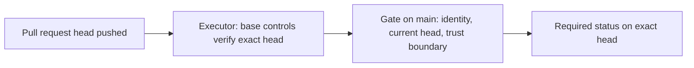

# Managed verification reference

Swamp owns the deterministic source checks. GitHub owns execution, exact-SHA
coordination, and the required status.

Release artifacts are rebuilt by trusted release infrastructure; pull request
artifacts are never promoted.

## Components

| Path                                               | Purpose                                                |
| -------------------------------------------------- | ------------------------------------------------------ |
| `workflows/workflow-verification.yaml`             | Shared deterministic verification DAG (parallel lanes) |
| `verification/managed-policy.json`                 | Code owner and trust-boundary paths                    |
| `.github/workflows/swamp-managed-verification.yml` | Permission-free executor on every non-draft PR head    |
| `.github/workflows/swamp-managed-gate.yml`         | Gate on `main` that sets the exact-head status         |
| `scripts/workflow-policy.test.mjs`                 | Workflow pin, trigger, permission, and timeout policy  |

The workflow uses these models:

| Model                     | Type                         | Purpose                                                    |
| ------------------------- | ---------------------------- | ---------------------------------------------------------- |
| `verification-source-git` | `@swamp/git`                 | Verify exact subject/base identity and ancestry            |
| `verification-root`       | `@funsaized/npm/project`     | Install; format, typecheck, lint, build, bundle, release   |
| `verification-client`     | `@funsaized/npm/project`     | Install locked client dependencies                         |
| `verification-tests`      | `@funsaized/npm/project`     | Unit, factory, release, client and extension tests         |
| `verification-audits`     | `@funsaized/npm/project`     | Compatibility, token, and accessibility audits             |
| `verification-browser`    | `@funsaized/npm/project`     | Browser install and cross-browser tests                    |
| `verification-rust`       | `@funsaized/herdr-mise-rust` | Fallback-asset tests, then fmt, clippy, and embedded tests |

Swamp serializes steps that share a model, so each lane is its own model with
only its own scripts allowlisted. Only real dependencies remain: fallback-asset
tests precede the production build (they remove `client/dist`), and the Rust,
browser, and bundle steps follow the build.

## Gate rules

The gate reads everything through the API and never checks out pull request
code. It sets `success` only when the executor run succeeded, its head is still
the head of an open pull request against `main`, and either no trust-boundary
path changed or the pull request is the code owner's from this repository.
Skipped (draft) and cancelled (superseded) runs set no status.

`nightshift-ship` waits up to 30 minutes for that status on the exact candidate
and accepts it only when its target is a successful gate run from `main`.

For the contributor runbook and failure handling, see
[Managed verification](../local-verification.md).
