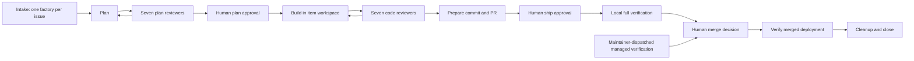

# Nightshift factory audit and proposed refactoring sequence

The factory delivers useful changes, but repeatedly pays for rediscovery, review
rework, and environment failures. Optimize **verified delivery per unit of agent
work and human attention**, with escaped defects as a constraint. The first move
should be better convergence and evidence reuse, followed by resource isolation
and concurrency. A replacement orchestration framework is not justified by this
audit.

This is an analysis and proposed plan, not an approved factory work item.

## Evidence and limits

Audited on September 20 against local HEAD `da23e5dd`. The shipping history
examined is September 1–13, 2026: 64 first-parent commits and 1,241 retained
workflow runs. No remote refresh was performed; “shipped” below means integrated
in this local history, not independently verified distribution to every user.
The latest retained fleet contains 34 items: 33 done and one aborted.

Sources: checked-in factory definitions, workflows, seven reviewer skills,
extension implementation/tests, CI controls, release notes, Git history, and
Swamp data/history queries. [Aggregate metrics and reproduction queries](software-factory-audit-2026-09-20.metrics.json)
retain the audit window and example record pointers. Raw prompts and transcripts
are excluded. Workflow history includes legacy items absent from the current
fleet, so its totals must not be divided by 33 as a delivery-efficiency measure.

No factory lifecycle was advanced, approvals granted, agents launched, or full
verification executed. Existing analytics report retrieval returned “Report not
found”; the analytics implementation exists and should be reused, but no fresh
report was generated during this audit. Measurements below are direct aggregates
of queried records, not the report's cohort-adjusted statistics.

Swamp initially failed to load macOS platform certificates inside the sandbox;
read-only discovery succeeded outside it. The CLI announced an automatic update
from `20260917.032111.0-sha.614bbc7e` to
`20260918.211634.0-sha.bcaa9695` during command discovery. This was not a deliberate
dependency upgrade and is another reason to record executable identity.

## How delivery currently works

Failure/retry, parking, abort, and human rework routes supplement this path.
[`nightshift-template.yaml`](../models/@swamp/software-factory/nightshift-template.yaml)
owns lifecycle policy. Per-item instances reduce model-lock contention and retain
their definitions; `the-nightshift` remains a legacy route. The resident driver
interprets fresh status and records dispatch, artifacts, evidence, and transitions.
[`nightshift-modes.md`](../.agents/skills/software-factory/references/nightshift-modes.md)
limits planning to one item, building to two, and review to seven lanes, with
other workflow overlap prohibited in one checkout.

The factory delegates execution to Swamp workflows. Agents plan, implement, and
review; deterministic model methods manage Git, evidence, issue linkage, and
deployment checks. Shipping runs a local full suite. Separately, managed CI runs
trusted controls from main against the proposed commit and supplies the required
merge status. Local evidence is advisory.

Preserve these strengths: explicit human approvals, exact revision identity,
untrusted-subject handling, per-item ownership, independent review, real fixtures,
trusted-control separation, post-merge checks, and durable failure evidence.

## What shipped, and what the sequence reveals

| Period    | Integrated work                                                                                                                                                                                                                       | Implication                                                                                                                                                             |
| --------- | ------------------------------------------------------------------------------------------------------------------------------------------------------------------------------------------------------------------------------------- | ----------------------------------------------------------------------------------------------------------------------------------------------------------------------- |
| Sep 1–4   | Autonomous factory phases (#118), review-gate fixes (#125), pinned ship evidence/worktrees (#129), plan-review correction (#132), global agent routing (#133), per-item factories (#136), prebuilt installation and v0.2.0 (#140–142) | The delivery mechanism evolved alongside the product; current behavior cannot explain every historical run.                                                             |
| Sep 5–7   | Recovery/release/accessibility hardening (#143), responsive and visual work (#152, #154–159, #171), managed-verification repairs (#153), factory evidence/process isolation (#170)                                                    | Operational reliability already consumed dedicated shipping work. Reuse these fixes and the existing backlog.                                                           |
| Sep 8–10  | State recovery, demo/live separation, timers, paging, stable identities, pane moves, inspection, dense layouts, workspace scope (#199–213)                                                                                            | Many changes touched overlapping state, identity, layout, and accessibility boundaries. Independent issue scheduling alone does not establish integration independence. |
| Sep 11–13 | Announcements, visual explorer, cleanup, history gaps, diagnostics, redraw performance, fixture recipes, compatibility canary, endurance profile, freezer overflow and demo story (#214–228)                                          | Both product capability and test infrastructure grew. Test scope and reviewer context need to follow behavior boundaries rather than accumulated file size.             |

These are delivery-history observations, not claims that a later fix proves a
defect escaped a particular earlier review. Establishing escape rate requires
linking defect reports to originating changes.

## Measured cost and failure patterns

| Workflow     | Attempts | Succeeded / failed / other | Median recorded duration |
| ------------ | -------: | -------------------------- | -----------------------: |
| Plan         |       79 | 76 / 1 / 2 running         |                 7.81 min |
| Build        |      249 | 236 / 10 / 3 running       |                 7.21 min |
| Review       |      335 | 323 / 12 / 0               |                 2.80 min |
| Ship         |      155 | 71 / 82 / 2 cancelled      |                 6.56 min |
| Verification |      151 | 74 / 77 / 0                |                 6.52 min |

“Succeeded” review means execution completed, not that the reviewers approved.
Ship contains verification; do not add their durations. Historical “running” rows
are unresolved records, not evidence of processes still running today.

The 335 reviews split into 77 plan and 258 code attempts. In the retained
34-item fleet, median build attempts per item is four. There are 268 retained
review artifact versions: 147 fail, 67 warn, 54 pass. These differ from workflow
counts because retention/cohort coverage differs and execution can fail before
recording an artifact.

Seven reviewer models account for roughly 62.6 summed invocation hours in this
window; parallel execution makes this different from wall time. Across all 2,651
retained agent invocations in the window, provider-normalized total tokens sum to
993.3 million, including provider-specific cache accounting. Of these invocations,
2,489 report zero cost. That is not evidence of free execution. Interactive driver
usage is unavailable, and routes changed over time; neither total dollars nor a
controlled model comparison can be inferred.

| Review lane   | Invocations | Fail verdicts | Approx. summed hours |
| ------------- | ----------: | ------------: | -------------------: |
| Test coverage |         335 |            89 |                  9.6 |
| Clean code    |         331 |            65 |                 10.4 |
| Frontend      |         327 |            61 |                 12.8 |
| Accessibility |         334 |            33 |                  7.1 |
| Observability |         335 |            26 |                  7.4 |
| DDD           |         330 |             7 |                  8.2 |
| Security      |         336 |             3 |                  7.2 |

Low failure frequency does not establish low value: a rare security finding may
justify the entire lane. These figures motivate measured routing experiments,
not deleting reviewers.

Of 69 retained shipping-failure evidence records, 27 are classified infrastructure,
21 configuration, and 21 candidate. These are recorded classifications, not an
independent root-cause adjudication; some diagnoses changed after reproduction.
Concrete recurring causes include stale shipping branches, ignored build-info
files preventing cleanup, Deno/environment forwarding, browser startup failures,
lost logs, occupied ports, and transcribed candidate SHAs. Product/test failures
also occurred: focus restoration, responsive geometry, stale assertions, Clippy,
and integration after main changed.

## Findings and recommended design

**1. Review convergence is the largest visible agent-work opportunity.**
[`nightshift-review`](../workflows/workflow-nightshift-review.yaml) launches all
seven lanes on every round and concatenates findings with a synthetic `ROUND`.
It requires at least one finding even for passes and validates a specific phrase
in every high finding. This adds presentation coupling without proving defect
quality. The workflow has extensive repeated validation and aggregation CEL.

Item 181 has 22 stored code-review versions. Early rounds caught clipped TUI
details, unused identity projection, scope expansion, ambiguous display names,
and inaccessible identity disambiguation. Item 179 exposed pager occlusion and a
real failing viewport test, but also a blocking duplicated visual constant.
These examples demonstrate useful review and severity/convergence problems;
they do not support labeling all rework as waste.

Introduce stable finding identity, evidence location, violated requirement,
impact, disposition, and regression proof. Separate defect severity from lane
verdict. Use explicit “not applicable” and allow zero defects on a pass. Retain
independent first reviews; give subsequent reviewers the candidate delta and
prior dispositions. After two repeated rounds, adjudicate disputed scope or
severity instead of automatically sending the same broad instructions again.
Keep the existing parking/human boundary until its replacement is approved.

Pilot targeted re-review only with exact subject, base, policy, and skill
fingerprints. Reuse requires proof the relevant surface and dependencies are
unchanged; unknown impact, shared-boundary edits, or base movement invalidate it.
Run shadow full reviews to detect findings that selective routing would miss.
Do not infer safe reuse merely because a lane passed previously.

**2. Test evidence is expensive to interpret and insufficiently bound to source.**
The builder records command/result prose and an invocation ID. The test reviewer
reads the transcript or reruns the command. The
[`test-coverage skill`](../.agents/skills/nightshift-test-coverage/SKILL.md) both
permits reviewer-run proof and instructs failure when invocationId is absent.
Resolve this contradiction. More fundamentally, an invocation pointer alone is
not a receipt for the current working-tree contents.

Have the existing execution integration produce structured receipts containing
command/arguments, exit status, test selection and count, source tree identity,
toolchain identity, timestamps, and durable logs. Bind uncommitted work to a
content digest and committed work to its SHA. Reject zero selected tests and
stale evidence deterministically. The reviewer assesses whether the test proves
the behavior; it should not have to reconstruct execution bookkeeping from prose.

**3. Shipping duplicates an expensive environment-sensitive path.**
[`nightshift-ship`](../workflows/workflow-nightshift-ship.yaml) mandates local full
verification, while [managed verification](local-verification.md) is authoritative.
The local browser environment repeatedly blocked candidates. Current policy
therefore spends a full local pass without removing the required managed pass.

Propose local focused checks plus cheap candidate preflight, followed by a factory
stage that waits for and validates the existing managed result for exact head,
base, controls, and policy. Keep maintainer dispatch and owner-only trust-boundary
dispatch. Do not equate a generic green CI check with the attestation. Preserve
deployment verification. This changes factory gates and needs normal reviewed
delivery; it is not permission to bypass today's shipping stage.

Generate candidate metadata directly from Git and the linked PR through existing
integrations, eliminating manual SHA transcription. Repeated unchanged environment
failures should produce one diagnostic escalation and a blocked resource, rather
than another full build or verification run.

**4. Verification ordering and test packaging obscure the true critical path.**
[`verification`](../workflows/workflow-verification.yaml) is predominantly serial:
format → typecheck → lint → Node/client tests → extension tests → compatibility
and audits → browser install → fallback tests → build → Rust → browser tests →
bundle budget → release bundle → release validation.

Some ordering is real: assets precede embedding, destructive fallback-asset tests
cannot race builds, and shared model locks serialize model methods. Other checks
can potentially overlap once they have separate resource ownership. Removing DAG
edges alone is unsafe and may merely move waiting into model locks.

Separate fast source checks, provisioned factory integration, browser behavior,
release packaging, and endurance profiles. Keep all required coverage in managed
verification. Cache downloads/toolchains by pinned identity, build each necessary
artifact once, and consume explicit output identities. Benchmark cold and warm
paths before expanding concurrency. The Playwright “prepared” path still builds
the Rust binary and visual client; count these explicitly rather than assuming
all build work was reused.

**5. Factory tests need more behavior coverage at their actual seams.**
The product has useful layers: Rust fixtures/feed/TUI tests, Vitest/Testing Library,
Playwright behavior and cross-browser accessibility, compatibility fixtures,
packaged-release checks, and performance/endurance profiles. Preserve these.

Factory coverage mixes Deno unit tests using fake repositories, extensive text
contracts, and a real temporary Swamp server integration test. The real test
provisions the pinned factory but does not load the local correlation extension.
Text tests verify configuration shape, not runtime status/advance equivalence,
crash recovery, or effective sandbox behavior. `npm test` also includes this
provisioning integration via `scripts/*.test.mjs`; an apparently routine unit
command therefore acquires process/provisioning dependencies.

Create an explicit factory-integration test tier. Exercise the real template,
local extension checks, deterministic fake agent outputs, malformed/stale
receipts, duplicate intake, restart between writes, and replayed publication.
Replace formatting-sensitive regex tests with parsed structural assertions where
structure is the contract. Keep negative executable tests for enforcement. Split
the 3,451-line visual matrix by behavior and give tests stable identifiers; file
splitting alone is not a performance improvement.

**6. Skills and policy need clearer ownership.**
The skills contain valuable boundaries and false-positive guidance, but overlap:
tokens appear in clean-code/frontend, truthful status in frontend/observability,
and state ordering in DDD/observability. Several style rules are unconditional
high-severity failures. The security skill principally covers the localhost
product; factory changes additionally need worker, credential, evidence, and CI
trust analysis.

Use one shared review contract plus lane-specific criteria, with explicit product,
factory, and release applicability. Give each invariant a primary lane and allow
corroboration without duplicate blockers. Maintain small calibration cases from
real accepted/rejected findings. Version skill/policy fingerprints in results.
Effective agent routing also depends on global OpenCode configuration; record
resolved provider/model/variant and a routing digest rather than trusting YAML
defaults alone. Choose models only after replay evaluation on this repository.

**7. Correctness gaps constrain safe concurrency.**
The [previous factory backlog](software-factory-backlog-2026-09-07.md) and
[upstream handoff](upstream/README.md) document status/advance disagreement and
non-atomic definition/state operations. The lock still pins software-factory
`2026.06.24.1`; the handoff is not an installed fix. Do not repeat completed
SF-001/002/004/005/006/008 work or present SF-003/007 as solved.

[Worker isolation](agent-worker-isolation.md) is a target design with deployment
acceptance marked NOT RUN. Current sandbox flags do not prove that design is
deployed. Before raising throughput, establish effective worker boundaries,
exclusive mutable build/browser resources, per-item ownership, cancellation,
recovery, and output correlation. Scheduling should respect overlapping product
boundaries as well as file overlap. Start with two builders and improve observed
utilization before increasing the cap.

## Proposed implementation sequence

| Step                                         | Scope and dependency                                                                                                                                                              | Acceptance evidence                                                                                                                                                        |
| -------------------------------------------- | --------------------------------------------------------------------------------------------------------------------------------------------------------------------------------- | -------------------------------------------------------------------------------------------------------------------------------------------------------------------------- |
| 1. Establish a reproducible baseline         | Extend the existing `nightshift_review_analytics.ts` report; connect history, stage waits, retries, exact source identities, and managed results. No new analytics engine.        | Report cohort coverage and missing data; distinguish execution, queue/human wait, rework, infrastructure, and configuration. Reproduce this audit's counts.                |
| 2. Make evidence and preflight deterministic | Structured test receipts, automatic candidate metadata, early environment checks, durable diagnostics, bounded retry classification.                                              | Wrong SHA/tree, zero tests, stale receipt, missing runtime, bad output, and repeated unchanged failures produce specific failures without unnecessary rebuilds.            |
| 3. Improve review convergence                | Shared typed result contract; severity calibration; stable findings; eliminate phrase coupling; explicit adjudication. Depends on step 1 for measurement and step 2 for evidence. | Replay historical real defects and disputed findings; all seeded high-impact defects remain blocking; no duplicate blockers; measure first-pass and two-round convergence. |
| 4. Consolidate verification                  | Make managed evidence the authoritative factory shipping input; retain approvals and deployed smoke. Separate fast, integration, browser, release, endurance tiers.               | Reject wrong head/base/control/policy/dispatcher; pass valid current evidence; simulate base movement; compare actual cold/warm critical path.                             |
| 5. Pilot selective review                    | Change-aware initial routing and delta re-review with conservative invalidation, then shadow full review. Depends on steps 1–3.                                                   | Unknown/shared/trust-boundary impact selects full review; reused output identifies original subject and applicability proof; shadow review misses trigger rollback.        |
| 6. Strengthen runtime guarantees             | Deliver upstream status/advance parity and create-if-absent/crash recovery; test local extension integration; prove worker isolation. Can progress alongside steps 2–4.           | Executable status/advance parity, fault injection, concurrent intake, cancellation/restart, and worker canaries. No claimed atomicity from a restart happy path.           |
| 7. Expand safe parallel execution            | Resource-aware verification DAG and scheduling across proven independent subjects. Depends on step 6 and measured critical paths.                                                 | No lock contention amplification, port/output collisions, stale evidence, or cross-item mutations; higher delivered throughput at unchanged defect detection.              |

This ordering follows the Swamp skill's
[Architecture Decision Guide](/Users/saiguy/.agents/skills/swamp/references/architecture/guide.md):
reports analyze, model methods perform typed actions, and workflows compose those
actions. Search installed/community capabilities before extending any integration.
Keep the generic factory generic and Nightshift policy in this repository.

Treat each row as a separately reviewable delivery slice. Do not combine a gate
change, reviewer/model change, and concurrency change in one experiment. Existing
human approvals remain in force. Preserve original records and pin each item's
policy; make migrations explicit and reversible.

## Success criteria and open decisions

Suggested pilot targets, not promised results: reduce comparable-cohort agent
tokens per delivered item by 30%, halve repeated environment-failure attempts,
bring median build attempts from four toward two, and reduce verification p95
without weakening required controls. Baseline p95, human wait, true provider cost,
and escape rate first; this audit does not establish them.

Measure escaped defects/severity, seeded-defect detection, adjudicated false
positives, time to useful feedback, time to merge, human interventions, and resource
contention alongside throughput. Review at least ten comparable completed items
per pilot and retain full-review shadow samples; this is an operational checkpoint,
not statistical proof of safety. Stop or revert when a material defect would have
been missed or evidence identity cannot be established.

Before implementation, agree on: the relative priority of human attention,
wall-clock latency and provider spend; whether mandatory local full verification
should be replaced by consuming managed evidence; and whether worker deployment
is in scope now. None prevents starting with measurement and receipt design.
